# Course Project

### Group Name : Group 140
### Full Name : Milind Shailehskumar Parvatia 
### ID : S3806853
### Full Name : Ajaykumar Himmatbhai Kothiya
### ID : S3793661

# Source And Description of Dataset

The dataset here we have used for the case study is related to bank marketing.

*   The data is related to direct marketing campaigns of Portuguese banking institutions.Often, more than one contact to the same client was required, to access if the product (bank term deposit) would be ('yes') or not ('no') subscribed.
*   Here the marketing campaigns are directly related to phone calls. This dataset has 17 attributes and 4521 instances. in which The descriptive features include 7 numeric and 9 nominal categorical features. The target feature has two classes defined as "yes" and "no" respectively.
*   Source of the dataset : [Moro et al., 2014] S. Moro, P. Cortez and P. Rita. A Data-Driven Approach to Predict the Success of Bank Telemarketing. Decision Support Systems, Elsevier, 62:22-31, June 2014, Available at (https://archive.ics.uci.edu/ml/datasets/Bank+Marketing)

# Objective 

Our goal is to predict whether a client will subscribe(yes/no) a term deposit, hence The target for this dataset is term deposit(variable y).

# Data Preparation

## Retriving Dataset


```python
# Importing all the required libraries for the project

!pip install --upgrade altair
!pip install vega vega_datasets

import scipy
import warnings
import numpy as np
import pandas as pd
import altair as alt
import matplotlib.pyplot as plt

from scipy import stats
from sklearn import metrics, preprocessing
from IPython.core.interactiveshell import InteractiveShell
from sklearn.svm import SVC
from sklearn.pipeline import Pipeline
from sklearn.naive_bayes import GaussianNB
from sklearn.tree import DecisionTreeClassifier
from sklearn.neighbors import KNeighborsClassifier
from sklearn.preprocessing import PowerTransformer
from sklearn.ensemble import RandomForestClassifier
from sklearn.base import BaseEstimator, TransformerMixin
from sklearn.model_selection import StratifiedKFold, GridSearchCV, train_test_split ,cross_val_score, RandomizedSearchCV

warnings.filterwarnings("ignore")
%config InlineBackend.figure_format = 'retina'
InteractiveShell.ast_node_interactivity = "all"
alt.renderers.enable('html') # required in Jupyter notebooks
```

    Requirement already up-to-date: altair in /usr/local/lib/python3.7/site-packages (4.1.0)
    Requirement already satisfied, skipping upgrade: jsonschema in /Users/milind/Library/Python/3.7/lib/python/site-packages (from altair) (3.2.0)
    Requirement already satisfied, skipping upgrade: toolz in /usr/local/lib/python3.7/site-packages (from altair) (0.10.0)
    Requirement already satisfied, skipping upgrade: pandas>=0.18 in /usr/local/lib/python3.7/site-packages (from altair) (1.0.3)
    Requirement already satisfied, skipping upgrade: numpy in /usr/local/lib/python3.7/site-packages (from altair) (1.18.4)
    Requirement already satisfied, skipping upgrade: jinja2 in /Users/milind/Library/Python/3.7/lib/python/site-packages (from altair) (2.11.1)
    Requirement already satisfied, skipping upgrade: entrypoints in /Users/milind/Library/Python/3.7/lib/python/site-packages (from altair) (0.3)
    Requirement already satisfied, skipping upgrade: six>=1.11.0 in /Users/milind/Library/Python/3.7/lib/python/site-packages (from jsonschema->altair) (1.12.0)
    Requirement already satisfied, skipping upgrade: attrs>=17.4.0 in /Users/milind/Library/Python/3.7/lib/python/site-packages (from jsonschema->altair) (19.3.0)
    Requirement already satisfied, skipping upgrade: setuptools in /usr/local/lib/python3.7/site-packages (from jsonschema->altair) (41.4.0)
    Requirement already satisfied, skipping upgrade: importlib-metadata; python_version < "3.8" in /Users/milind/Library/Python/3.7/lib/python/site-packages (from jsonschema->altair) (1.5.0)
    Requirement already satisfied, skipping upgrade: pyrsistent>=0.14.0 in /Users/milind/Library/Python/3.7/lib/python/site-packages (from jsonschema->altair) (0.15.7)
    Requirement already satisfied, skipping upgrade: pytz>=2017.2 in /usr/local/lib/python3.7/site-packages (from pandas>=0.18->altair) (2020.1)
    Requirement already satisfied, skipping upgrade: python-dateutil>=2.6.1 in /Users/milind/Library/Python/3.7/lib/python/site-packages (from pandas>=0.18->altair) (2.8.1)
    Requirement already satisfied, skipping upgrade: MarkupSafe>=0.23 in /Users/milind/Library/Python/3.7/lib/python/site-packages (from jinja2->altair) (1.1.1)
    Requirement already satisfied, skipping upgrade: zipp>=0.5 in /Users/milind/Library/Python/3.7/lib/python/site-packages (from importlib-metadata; python_version < "3.8"->jsonschema->altair) (2.2.0)
    WARNING: You are using pip version 20.0.2; however, version 20.1.1 is available.
    You should consider upgrading via the '/usr/local/opt/python/bin/python3.7 -m pip install --upgrade pip' command.
    Requirement already satisfied: vega in /usr/local/lib/python3.7/site-packages (3.4.0)
    Requirement already satisfied: vega_datasets in /usr/local/lib/python3.7/site-packages (0.8.0)
    Requirement already satisfied: pandas<2.0.0,>=1.0.0 in /usr/local/lib/python3.7/site-packages (from vega) (1.0.3)
    Requirement already satisfied: jupyter<2.0.0,>=1.0.0 in /Users/milind/Library/Python/3.7/lib/python/site-packages (from vega) (1.0.0)
    Requirement already satisfied: python-dateutil>=2.6.1 in /Users/milind/Library/Python/3.7/lib/python/site-packages (from pandas<2.0.0,>=1.0.0->vega) (2.8.1)
    Requirement already satisfied: numpy>=1.13.3 in /usr/local/lib/python3.7/site-packages (from pandas<2.0.0,>=1.0.0->vega) (1.18.4)
    Requirement already satisfied: pytz>=2017.2 in /usr/local/lib/python3.7/site-packages (from pandas<2.0.0,>=1.0.0->vega) (2020.1)
    Requirement already satisfied: jupyter-console in /Users/milind/Library/Python/3.7/lib/python/site-packages (from jupyter<2.0.0,>=1.0.0->vega) (6.1.0)
    Requirement already satisfied: nbconvert in /Users/milind/Library/Python/3.7/lib/python/site-packages (from jupyter<2.0.0,>=1.0.0->vega) (5.6.1)
    Requirement already satisfied: ipykernel in /Users/milind/Library/Python/3.7/lib/python/site-packages (from jupyter<2.0.0,>=1.0.0->vega) (5.1.4)
    Requirement already satisfied: notebook in /Users/milind/Library/Python/3.7/lib/python/site-packages (from jupyter<2.0.0,>=1.0.0->vega) (6.0.3)
    Requirement already satisfied: qtconsole in /Users/milind/Library/Python/3.7/lib/python/site-packages (from jupyter<2.0.0,>=1.0.0->vega) (4.6.0)
    Requirement already satisfied: ipywidgets in /Users/milind/Library/Python/3.7/lib/python/site-packages (from jupyter<2.0.0,>=1.0.0->vega) (7.5.1)
    Requirement already satisfied: six>=1.5 in /Users/milind/Library/Python/3.7/lib/python/site-packages (from python-dateutil>=2.6.1->pandas<2.0.0,>=1.0.0->vega) (1.12.0)
    Requirement already satisfied: pygments in /Users/milind/Library/Python/3.7/lib/python/site-packages (from jupyter-console->jupyter<2.0.0,>=1.0.0->vega) (2.5.2)
    Requirement already satisfied: prompt-toolkit!=3.0.0,!=3.0.1,<3.1.0,>=2.0.0 in /Users/milind/Library/Python/3.7/lib/python/site-packages (from jupyter-console->jupyter<2.0.0,>=1.0.0->vega) (3.0.3)
    Requirement already satisfied: ipython in /Users/milind/Library/Python/3.7/lib/python/site-packages (from jupyter-console->jupyter<2.0.0,>=1.0.0->vega) (7.12.0)
    Requirement already satisfied: jupyter-client in /Users/milind/Library/Python/3.7/lib/python/site-packages (from jupyter-console->jupyter<2.0.0,>=1.0.0->vega) (5.3.4)
    Requirement already satisfied: defusedxml in /Users/milind/Library/Python/3.7/lib/python/site-packages (from nbconvert->jupyter<2.0.0,>=1.0.0->vega) (0.6.0)
    Requirement already satisfied: jinja2>=2.4 in /Users/milind/Library/Python/3.7/lib/python/site-packages (from nbconvert->jupyter<2.0.0,>=1.0.0->vega) (2.11.1)
    Requirement already satisfied: traitlets>=4.2 in /Users/milind/Library/Python/3.7/lib/python/site-packages (from nbconvert->jupyter<2.0.0,>=1.0.0->vega) (4.3.3)
    Requirement already satisfied: nbformat>=4.4 in /Users/milind/Library/Python/3.7/lib/python/site-packages (from nbconvert->jupyter<2.0.0,>=1.0.0->vega) (5.0.4)
    Requirement already satisfied: bleach in /Users/milind/Library/Python/3.7/lib/python/site-packages (from nbconvert->jupyter<2.0.0,>=1.0.0->vega) (3.1.0)
    Requirement already satisfied: pandocfilters>=1.4.1 in /Users/milind/Library/Python/3.7/lib/python/site-packages (from nbconvert->jupyter<2.0.0,>=1.0.0->vega) (1.4.2)
    Requirement already satisfied: entrypoints>=0.2.2 in /Users/milind/Library/Python/3.7/lib/python/site-packages (from nbconvert->jupyter<2.0.0,>=1.0.0->vega) (0.3)
    Requirement already satisfied: testpath in /Users/milind/Library/Python/3.7/lib/python/site-packages (from nbconvert->jupyter<2.0.0,>=1.0.0->vega) (0.4.4)
    Requirement already satisfied: mistune<2,>=0.8.1 in /Users/milind/Library/Python/3.7/lib/python/site-packages (from nbconvert->jupyter<2.0.0,>=1.0.0->vega) (0.8.4)
    Requirement already satisfied: jupyter-core in /Users/milind/Library/Python/3.7/lib/python/site-packages (from nbconvert->jupyter<2.0.0,>=1.0.0->vega) (4.6.1)
    Requirement already satisfied: appnope; platform_system == "Darwin" in /Users/milind/Library/Python/3.7/lib/python/site-packages (from ipykernel->jupyter<2.0.0,>=1.0.0->vega) (0.1.0)
    Requirement already satisfied: tornado>=4.2 in /Users/milind/Library/Python/3.7/lib/python/site-packages (from ipykernel->jupyter<2.0.0,>=1.0.0->vega) (6.0.3)
    Requirement already satisfied: terminado>=0.8.1 in /Users/milind/Library/Python/3.7/lib/python/site-packages (from notebook->jupyter<2.0.0,>=1.0.0->vega) (0.8.3)
    Requirement already satisfied: prometheus-client in /Users/milind/Library/Python/3.7/lib/python/site-packages (from notebook->jupyter<2.0.0,>=1.0.0->vega) (0.7.1)
    Requirement already satisfied: pyzmq>=17 in /Users/milind/Library/Python/3.7/lib/python/site-packages (from notebook->jupyter<2.0.0,>=1.0.0->vega) (18.1.1)
    Requirement already satisfied: ipython-genutils in /Users/milind/Library/Python/3.7/lib/python/site-packages (from notebook->jupyter<2.0.0,>=1.0.0->vega) (0.2.0)
    Requirement already satisfied: Send2Trash in /Users/milind/Library/Python/3.7/lib/python/site-packages (from notebook->jupyter<2.0.0,>=1.0.0->vega) (1.5.0)
    Requirement already satisfied: widgetsnbextension~=3.5.0 in /Users/milind/Library/Python/3.7/lib/python/site-packages (from ipywidgets->jupyter<2.0.0,>=1.0.0->vega) (3.5.1)
    Requirement already satisfied: wcwidth in /Users/milind/Library/Python/3.7/lib/python/site-packages (from prompt-toolkit!=3.0.0,!=3.0.1,<3.1.0,>=2.0.0->jupyter-console->jupyter<2.0.0,>=1.0.0->vega) (0.1.8)
    Requirement already satisfied: backcall in /Users/milind/Library/Python/3.7/lib/python/site-packages (from ipython->jupyter-console->jupyter<2.0.0,>=1.0.0->vega) (0.1.0)
    Requirement already satisfied: pickleshare in /Users/milind/Library/Python/3.7/lib/python/site-packages (from ipython->jupyter-console->jupyter<2.0.0,>=1.0.0->vega) (0.7.5)
    Requirement already satisfied: pexpect; sys_platform != "win32" in /Users/milind/Library/Python/3.7/lib/python/site-packages (from ipython->jupyter-console->jupyter<2.0.0,>=1.0.0->vega) (4.8.0)
    Requirement already satisfied: setuptools>=18.5 in /usr/local/lib/python3.7/site-packages (from ipython->jupyter-console->jupyter<2.0.0,>=1.0.0->vega) (41.4.0)
    Requirement already satisfied: decorator in /Users/milind/Library/Python/3.7/lib/python/site-packages (from ipython->jupyter-console->jupyter<2.0.0,>=1.0.0->vega) (4.4.1)
    Requirement already satisfied: jedi>=0.10 in /Users/milind/Library/Python/3.7/lib/python/site-packages (from ipython->jupyter-console->jupyter<2.0.0,>=1.0.0->vega) (0.16.0)
    Requirement already satisfied: MarkupSafe>=0.23 in /Users/milind/Library/Python/3.7/lib/python/site-packages (from jinja2>=2.4->nbconvert->jupyter<2.0.0,>=1.0.0->vega) (1.1.1)
    Requirement already satisfied: jsonschema!=2.5.0,>=2.4 in /Users/milind/Library/Python/3.7/lib/python/site-packages (from nbformat>=4.4->nbconvert->jupyter<2.0.0,>=1.0.0->vega) (3.2.0)
    Requirement already satisfied: webencodings in /Users/milind/Library/Python/3.7/lib/python/site-packages (from bleach->nbconvert->jupyter<2.0.0,>=1.0.0->vega) (0.5.1)
    Requirement already satisfied: ptyprocess; os_name != "nt" in /Users/milind/Library/Python/3.7/lib/python/site-packages (from terminado>=0.8.1->notebook->jupyter<2.0.0,>=1.0.0->vega) (0.6.0)
    Requirement already satisfied: parso>=0.5.2 in /Users/milind/Library/Python/3.7/lib/python/site-packages (from jedi>=0.10->ipython->jupyter-console->jupyter<2.0.0,>=1.0.0->vega) (0.6.1)
    Requirement already satisfied: importlib-metadata; python_version < "3.8" in /Users/milind/Library/Python/3.7/lib/python/site-packages (from jsonschema!=2.5.0,>=2.4->nbformat>=4.4->nbconvert->jupyter<2.0.0,>=1.0.0->vega) (1.5.0)
    Requirement already satisfied: pyrsistent>=0.14.0 in /Users/milind/Library/Python/3.7/lib/python/site-packages (from jsonschema!=2.5.0,>=2.4->nbformat>=4.4->nbconvert->jupyter<2.0.0,>=1.0.0->vega) (0.15.7)
    Requirement already satisfied: attrs>=17.4.0 in /Users/milind/Library/Python/3.7/lib/python/site-packages (from jsonschema!=2.5.0,>=2.4->nbformat>=4.4->nbconvert->jupyter<2.0.0,>=1.0.0->vega) (19.3.0)
    Requirement already satisfied: zipp>=0.5 in /Users/milind/Library/Python/3.7/lib/python/site-packages (from importlib-metadata; python_version < "3.8"->jsonschema!=2.5.0,>=2.4->nbformat>=4.4->nbconvert->jupyter<2.0.0,>=1.0.0->vega) (2.2.0)
    WARNING: You are using pip version 20.0.2; however, version 20.1.1 is available.
    You should consider upgrading via the '/usr/local/opt/python/bin/python3.7 -m pip install --upgrade pip' command.


    RendererRegistry.enable('html')


```python
# Reading .csv file as df with sep=',' as argument to function

df = pd.read_csv('bank.csv', sep=',')
```


```python
# Representing Head of dataframe

df.head()
```


<div>
<style scoped>
    .dataframe tbody tr th:only-of-type {
        vertical-align: middle;
    }

    .dataframe tbody tr th {
        vertical-align: top;
    }

    .dataframe thead th {
        text-align: right;
    }
</style>
<table border="1" class="dataframe">
  <thead>
    <tr style="text-align: right;">
      <th></th>
      <th>age</th>
      <th>job</th>
      <th>marital</th>
      <th>education</th>
      <th>default</th>
      <th>balance</th>
      <th>housing</th>
      <th>loan</th>
      <th>contact</th>
      <th>day</th>
      <th>month</th>
      <th>duration</th>
      <th>campaign</th>
      <th>pdays</th>
      <th>previous</th>
      <th>poutcome</th>
      <th>y</th>
    </tr>
  </thead>
  <tbody>
    <tr>
      <th>0</th>
      <td>30</td>
      <td>unemployed</td>
      <td>married</td>
      <td>primary</td>
      <td>no</td>
      <td>1787</td>
      <td>no</td>
      <td>no</td>
      <td>cellular</td>
      <td>19</td>
      <td>oct</td>
      <td>79</td>
      <td>1</td>
      <td>-1</td>
      <td>0</td>
      <td>unknown</td>
      <td>no</td>
    </tr>
    <tr>
      <th>1</th>
      <td>33</td>
      <td>services</td>
      <td>married</td>
      <td>secondary</td>
      <td>no</td>
      <td>4789</td>
      <td>yes</td>
      <td>yes</td>
      <td>cellular</td>
      <td>11</td>
      <td>may</td>
      <td>220</td>
      <td>1</td>
      <td>339</td>
      <td>4</td>
      <td>failure</td>
      <td>no</td>
    </tr>
    <tr>
      <th>2</th>
      <td>35</td>
      <td>management</td>
      <td>single</td>
      <td>tertiary</td>
      <td>no</td>
      <td>1350</td>
      <td>yes</td>
      <td>no</td>
      <td>cellular</td>
      <td>16</td>
      <td>apr</td>
      <td>185</td>
      <td>1</td>
      <td>330</td>
      <td>1</td>
      <td>failure</td>
      <td>no</td>
    </tr>
    <tr>
      <th>3</th>
      <td>30</td>
      <td>management</td>
      <td>married</td>
      <td>tertiary</td>
      <td>no</td>
      <td>1476</td>
      <td>yes</td>
      <td>yes</td>
      <td>unknown</td>
      <td>3</td>
      <td>jun</td>
      <td>199</td>
      <td>4</td>
      <td>-1</td>
      <td>0</td>
      <td>unknown</td>
      <td>no</td>
    </tr>
    <tr>
      <th>4</th>
      <td>59</td>
      <td>blue-collar</td>
      <td>married</td>
      <td>secondary</td>
      <td>no</td>
      <td>0</td>
      <td>yes</td>
      <td>no</td>
      <td>unknown</td>
      <td>5</td>
      <td>may</td>
      <td>226</td>
      <td>1</td>
      <td>-1</td>
      <td>0</td>
      <td>unknown</td>
      <td>no</td>
    </tr>
  </tbody>
</table>
</div>


```python
# Showing size of Dataframe

df.shape
```


    (4521, 17)


```python
# Listing all columns of Dataframes

df.columns.values
```


    array(['age', 'job', 'marital', 'education', 'default', 'balance',
           'housing', 'loan', 'contact', 'day', 'month', 'duration',
           'campaign', 'pdays', 'previous', 'poutcome', 'y'], dtype=object)


```python
# Representing Dataframes datatypes

df.dtypes
```


    age           int64
    job          object
    marital      object
    education    object
    default      object
    balance       int64
    housing      object
    loan         object
    contact      object
    day           int64
    month        object
    duration      int64
    campaign      int64
    pdays         int64
    previous      int64
    poutcome     object
    y            object
    dtype: object


## Handling Outliers and Missing Values


```python
# Handling outlier's and removing rows if Z.score if > 3

for column in df:
    if df[column].dtypes == np.int64:
        df = df[(np.abs(stats.zscore(df[column])) < 3)]
```


```python
# Representing null values of every columns

df.isnull().sum()
```


    age          0
    job          0
    marital      0
    education    0
    default      0
    balance      0
    housing      0
    loan         0
    contact      0
    day          0
    month        0
    duration     0
    campaign     0
    pdays        0
    previous     0
    poutcome     0
    y            0
    dtype: int64


```python
# Showing 5 randomly selected rows in this raw dataset

df.sample(n=5, random_state=0)
```


<div>
<style scoped>
    .dataframe tbody tr th:only-of-type {
        vertical-align: middle;
    }

    .dataframe tbody tr th {
        vertical-align: top;
    }

    .dataframe thead th {
        text-align: right;
    }
</style>
<table border="1" class="dataframe">
  <thead>
    <tr style="text-align: right;">
      <th></th>
      <th>age</th>
      <th>job</th>
      <th>marital</th>
      <th>education</th>
      <th>default</th>
      <th>balance</th>
      <th>housing</th>
      <th>loan</th>
      <th>contact</th>
      <th>day</th>
      <th>month</th>
      <th>duration</th>
      <th>campaign</th>
      <th>pdays</th>
      <th>previous</th>
      <th>poutcome</th>
      <th>y</th>
    </tr>
  </thead>
  <tbody>
    <tr>
      <th>3728</th>
      <td>53</td>
      <td>technician</td>
      <td>married</td>
      <td>secondary</td>
      <td>no</td>
      <td>0</td>
      <td>no</td>
      <td>no</td>
      <td>cellular</td>
      <td>22</td>
      <td>aug</td>
      <td>77</td>
      <td>9</td>
      <td>-1</td>
      <td>0</td>
      <td>unknown</td>
      <td>no</td>
    </tr>
    <tr>
      <th>157</th>
      <td>55</td>
      <td>technician</td>
      <td>married</td>
      <td>secondary</td>
      <td>no</td>
      <td>273</td>
      <td>yes</td>
      <td>no</td>
      <td>cellular</td>
      <td>29</td>
      <td>jan</td>
      <td>84</td>
      <td>3</td>
      <td>183</td>
      <td>3</td>
      <td>failure</td>
      <td>no</td>
    </tr>
    <tr>
      <th>3616</th>
      <td>45</td>
      <td>management</td>
      <td>single</td>
      <td>tertiary</td>
      <td>no</td>
      <td>16</td>
      <td>no</td>
      <td>no</td>
      <td>cellular</td>
      <td>31</td>
      <td>jul</td>
      <td>59</td>
      <td>2</td>
      <td>-1</td>
      <td>0</td>
      <td>unknown</td>
      <td>no</td>
    </tr>
    <tr>
      <th>3003</th>
      <td>33</td>
      <td>management</td>
      <td>single</td>
      <td>tertiary</td>
      <td>no</td>
      <td>23</td>
      <td>no</td>
      <td>no</td>
      <td>cellular</td>
      <td>20</td>
      <td>aug</td>
      <td>216</td>
      <td>3</td>
      <td>-1</td>
      <td>0</td>
      <td>unknown</td>
      <td>no</td>
    </tr>
    <tr>
      <th>3257</th>
      <td>31</td>
      <td>admin.</td>
      <td>single</td>
      <td>secondary</td>
      <td>no</td>
      <td>1588</td>
      <td>yes</td>
      <td>no</td>
      <td>unknown</td>
      <td>3</td>
      <td>jun</td>
      <td>14</td>
      <td>1</td>
      <td>-1</td>
      <td>0</td>
      <td>unknown</td>
      <td>no</td>
    </tr>
  </tbody>
</table>
</div>


## Summary statistics


```python
# Showing summary statistics for the full data

df.describe(include='all')
```


<div>
<style scoped>
    .dataframe tbody tr th:only-of-type {
        vertical-align: middle;
    }

    .dataframe tbody tr th {
        vertical-align: top;
    }

    .dataframe thead th {
        text-align: right;
    }
</style>
<table border="1" class="dataframe">
  <thead>
    <tr style="text-align: right;">
      <th></th>
      <th>age</th>
      <th>job</th>
      <th>marital</th>
      <th>education</th>
      <th>default</th>
      <th>balance</th>
      <th>housing</th>
      <th>loan</th>
      <th>contact</th>
      <th>day</th>
      <th>month</th>
      <th>duration</th>
      <th>campaign</th>
      <th>pdays</th>
      <th>previous</th>
      <th>poutcome</th>
      <th>y</th>
    </tr>
  </thead>
  <tbody>
    <tr>
      <th>count</th>
      <td>3954.000000</td>
      <td>3954</td>
      <td>3954</td>
      <td>3954</td>
      <td>3954</td>
      <td>3954.000000</td>
      <td>3954</td>
      <td>3954</td>
      <td>3954</td>
      <td>3954.000000</td>
      <td>3954</td>
      <td>3954.000000</td>
      <td>3954.000000</td>
      <td>3954.000000</td>
      <td>3954.000000</td>
      <td>3954</td>
      <td>3954</td>
    </tr>
    <tr>
      <th>unique</th>
      <td>NaN</td>
      <td>12</td>
      <td>3</td>
      <td>4</td>
      <td>2</td>
      <td>NaN</td>
      <td>2</td>
      <td>2</td>
      <td>3</td>
      <td>NaN</td>
      <td>12</td>
      <td>NaN</td>
      <td>NaN</td>
      <td>NaN</td>
      <td>NaN</td>
      <td>4</td>
      <td>2</td>
    </tr>
    <tr>
      <th>top</th>
      <td>NaN</td>
      <td>management</td>
      <td>married</td>
      <td>secondary</td>
      <td>no</td>
      <td>NaN</td>
      <td>yes</td>
      <td>no</td>
      <td>cellular</td>
      <td>NaN</td>
      <td>may</td>
      <td>NaN</td>
      <td>NaN</td>
      <td>NaN</td>
      <td>NaN</td>
      <td>unknown</td>
      <td>no</td>
    </tr>
    <tr>
      <th>freq</th>
      <td>NaN</td>
      <td>842</td>
      <td>2454</td>
      <td>2021</td>
      <td>3882</td>
      <td>NaN</td>
      <td>2221</td>
      <td>3325</td>
      <td>2479</td>
      <td>NaN</td>
      <td>1191</td>
      <td>NaN</td>
      <td>NaN</td>
      <td>NaN</td>
      <td>NaN</td>
      <td>3459</td>
      <td>3564</td>
    </tr>
    <tr>
      <th>mean</th>
      <td>40.832828</td>
      <td>NaN</td>
      <td>NaN</td>
      <td>NaN</td>
      <td>NaN</td>
      <td>1111.301467</td>
      <td>NaN</td>
      <td>NaN</td>
      <td>NaN</td>
      <td>15.987607</td>
      <td>NaN</td>
      <td>242.521750</td>
      <td>2.507081</td>
      <td>22.860900</td>
      <td>0.251391</td>
      <td>NaN</td>
      <td>NaN</td>
    </tr>
    <tr>
      <th>std</th>
      <td>9.996059</td>
      <td>NaN</td>
      <td>NaN</td>
      <td>NaN</td>
      <td>NaN</td>
      <td>1767.777687</td>
      <td>NaN</td>
      <td>NaN</td>
      <td>NaN</td>
      <td>8.299363</td>
      <td>NaN</td>
      <td>198.906138</td>
      <td>2.007846</td>
      <td>69.865944</td>
      <td>0.758478</td>
      <td>NaN</td>
      <td>NaN</td>
    </tr>
    <tr>
      <th>min</th>
      <td>19.000000</td>
      <td>NaN</td>
      <td>NaN</td>
      <td>NaN</td>
      <td>NaN</td>
      <td>-3313.000000</td>
      <td>NaN</td>
      <td>NaN</td>
      <td>NaN</td>
      <td>1.000000</td>
      <td>NaN</td>
      <td>4.000000</td>
      <td>1.000000</td>
      <td>-1.000000</td>
      <td>0.000000</td>
      <td>NaN</td>
      <td>NaN</td>
    </tr>
    <tr>
      <th>25%</th>
      <td>33.000000</td>
      <td>NaN</td>
      <td>NaN</td>
      <td>NaN</td>
      <td>NaN</td>
      <td>61.000000</td>
      <td>NaN</td>
      <td>NaN</td>
      <td>NaN</td>
      <td>8.000000</td>
      <td>NaN</td>
      <td>105.000000</td>
      <td>1.000000</td>
      <td>-1.000000</td>
      <td>0.000000</td>
      <td>NaN</td>
      <td>NaN</td>
    </tr>
    <tr>
      <th>50%</th>
      <td>39.000000</td>
      <td>NaN</td>
      <td>NaN</td>
      <td>NaN</td>
      <td>NaN</td>
      <td>415.000000</td>
      <td>NaN</td>
      <td>NaN</td>
      <td>NaN</td>
      <td>16.000000</td>
      <td>NaN</td>
      <td>183.000000</td>
      <td>2.000000</td>
      <td>-1.000000</td>
      <td>0.000000</td>
      <td>NaN</td>
      <td>NaN</td>
    </tr>
    <tr>
      <th>75%</th>
      <td>48.000000</td>
      <td>NaN</td>
      <td>NaN</td>
      <td>NaN</td>
      <td>NaN</td>
      <td>1371.500000</td>
      <td>NaN</td>
      <td>NaN</td>
      <td>NaN</td>
      <td>21.000000</td>
      <td>NaN</td>
      <td>317.000000</td>
      <td>3.000000</td>
      <td>-1.000000</td>
      <td>0.000000</td>
      <td>NaN</td>
      <td>NaN</td>
    </tr>
    <tr>
      <th>max</th>
      <td>72.000000</td>
      <td>NaN</td>
      <td>NaN</td>
      <td>NaN</td>
      <td>NaN</td>
      <td>10378.000000</td>
      <td>NaN</td>
      <td>NaN</td>
      <td>NaN</td>
      <td>31.000000</td>
      <td>NaN</td>
      <td>1044.000000</td>
      <td>12.000000</td>
      <td>343.000000</td>
      <td>4.000000</td>
      <td>NaN</td>
      <td>NaN</td>
    </tr>
  </tbody>
</table>
</div>


## Encoding Target Feature


```python
# Removing y column from datafrmae and naming as "target", The rest of the features are the descriptive features which we call "Data".

Data = df.drop(columns='y')
target = df['y']
target.value_counts()
```


    no     3564
    yes     390
    Name: y, dtype: int64


```python
# encode the target feature so that the 'no' is '0' and 'yes' is '1'.

target = target.replace({'no': 0, 'yes': 1})
target.value_counts()
```


    0    3564
    1     390
    Name: y, dtype: int64


## Encoding Categorical Feature


```python
# Extracting the list of categorical descriptive features which are required to encode
categorical_cols = Data.columns[Data.dtypes==object].tolist()
```


```python
for col in categorical_cols:
    n = len(Data[col].unique())
    if (n == 2):
        Data[col] = pd.get_dummies(Data[col], drop_first=True)
   
# use one-hot-encoding for categorical features with >2 levels
Data = pd.get_dummies(Data)
```


```python
# Representing encoded data dataframe

Data.sample(5, random_state=999)
```


<div>
<style scoped>
    .dataframe tbody tr th:only-of-type {
        vertical-align: middle;
    }

    .dataframe tbody tr th {
        vertical-align: top;
    }

    .dataframe thead th {
        text-align: right;
    }
</style>
<table border="1" class="dataframe">
  <thead>
    <tr style="text-align: right;">
      <th></th>
      <th>age</th>
      <th>default</th>
      <th>balance</th>
      <th>housing</th>
      <th>loan</th>
      <th>day</th>
      <th>duration</th>
      <th>campaign</th>
      <th>pdays</th>
      <th>previous</th>
      <th>...</th>
      <th>month_jun</th>
      <th>month_mar</th>
      <th>month_may</th>
      <th>month_nov</th>
      <th>month_oct</th>
      <th>month_sep</th>
      <th>poutcome_failure</th>
      <th>poutcome_other</th>
      <th>poutcome_success</th>
      <th>poutcome_unknown</th>
    </tr>
  </thead>
  <tbody>
    <tr>
      <th>1152</th>
      <td>50</td>
      <td>0</td>
      <td>0</td>
      <td>0</td>
      <td>0</td>
      <td>4</td>
      <td>86</td>
      <td>4</td>
      <td>-1</td>
      <td>0</td>
      <td>...</td>
      <td>0</td>
      <td>0</td>
      <td>0</td>
      <td>0</td>
      <td>0</td>
      <td>0</td>
      <td>0</td>
      <td>0</td>
      <td>0</td>
      <td>1</td>
    </tr>
    <tr>
      <th>3873</th>
      <td>50</td>
      <td>0</td>
      <td>3304</td>
      <td>0</td>
      <td>0</td>
      <td>5</td>
      <td>1009</td>
      <td>2</td>
      <td>-1</td>
      <td>0</td>
      <td>...</td>
      <td>1</td>
      <td>0</td>
      <td>0</td>
      <td>0</td>
      <td>0</td>
      <td>0</td>
      <td>0</td>
      <td>0</td>
      <td>0</td>
      <td>1</td>
    </tr>
    <tr>
      <th>4399</th>
      <td>29</td>
      <td>0</td>
      <td>452</td>
      <td>1</td>
      <td>0</td>
      <td>27</td>
      <td>347</td>
      <td>1</td>
      <td>-1</td>
      <td>0</td>
      <td>...</td>
      <td>0</td>
      <td>0</td>
      <td>1</td>
      <td>0</td>
      <td>0</td>
      <td>0</td>
      <td>0</td>
      <td>0</td>
      <td>0</td>
      <td>1</td>
    </tr>
    <tr>
      <th>975</th>
      <td>34</td>
      <td>0</td>
      <td>215</td>
      <td>0</td>
      <td>0</td>
      <td>3</td>
      <td>350</td>
      <td>3</td>
      <td>-1</td>
      <td>0</td>
      <td>...</td>
      <td>0</td>
      <td>1</td>
      <td>0</td>
      <td>0</td>
      <td>0</td>
      <td>0</td>
      <td>0</td>
      <td>0</td>
      <td>0</td>
      <td>1</td>
    </tr>
    <tr>
      <th>2816</th>
      <td>34</td>
      <td>0</td>
      <td>586</td>
      <td>1</td>
      <td>0</td>
      <td>16</td>
      <td>489</td>
      <td>2</td>
      <td>-1</td>
      <td>0</td>
      <td>...</td>
      <td>0</td>
      <td>0</td>
      <td>1</td>
      <td>0</td>
      <td>0</td>
      <td>0</td>
      <td>0</td>
      <td>0</td>
      <td>0</td>
      <td>1</td>
    </tr>
  </tbody>
</table>
<p>5 rows × 48 columns</p>
</div>


## Scaling feature

Scaling is mandatory for some important class of models such as nearest neighbors, SVMs, and deep learning.

Min-Max Scaling: Each descriptive feature is scaled to be between 0 and 1. Min-max scaling for a numerical feature is done as follows:

scaled_value=value - min_valuemax_value - min_value


```python
# After encoding all the categorical features, we copy data df to keep track of column name and perform a min-max scaling of the descriptive features

Data_df = Data.copy()

Data_scaler = preprocessing.MinMaxScaler()
Data_scaler.fit(Data)
Data = Data_scaler.fit_transform(Data)
```


    MinMaxScaler(copy=True, feature_range=(0, 1))


```python
# Representing encoded data dataframe

pd.DataFrame(Data, columns=Data_df.columns).sample(5, random_state=999)
```


<div>
<style scoped>
    .dataframe tbody tr th:only-of-type {
        vertical-align: middle;
    }

    .dataframe tbody tr th {
        vertical-align: top;
    }

    .dataframe thead th {
        text-align: right;
    }
</style>
<table border="1" class="dataframe">
  <thead>
    <tr style="text-align: right;">
      <th></th>
      <th>age</th>
      <th>default</th>
      <th>balance</th>
      <th>housing</th>
      <th>loan</th>
      <th>day</th>
      <th>duration</th>
      <th>campaign</th>
      <th>pdays</th>
      <th>previous</th>
      <th>...</th>
      <th>month_jun</th>
      <th>month_mar</th>
      <th>month_may</th>
      <th>month_nov</th>
      <th>month_oct</th>
      <th>month_sep</th>
      <th>poutcome_failure</th>
      <th>poutcome_other</th>
      <th>poutcome_success</th>
      <th>poutcome_unknown</th>
    </tr>
  </thead>
  <tbody>
    <tr>
      <th>1014</th>
      <td>0.584906</td>
      <td>0.0</td>
      <td>0.241984</td>
      <td>0.0</td>
      <td>0.0</td>
      <td>0.100000</td>
      <td>0.078846</td>
      <td>0.272727</td>
      <td>0.0</td>
      <td>0.0</td>
      <td>...</td>
      <td>0.0</td>
      <td>0.0</td>
      <td>0.0</td>
      <td>0.0</td>
      <td>0.0</td>
      <td>0.0</td>
      <td>0.0</td>
      <td>0.0</td>
      <td>0.0</td>
      <td>1.0</td>
    </tr>
    <tr>
      <th>3385</th>
      <td>0.584906</td>
      <td>0.0</td>
      <td>0.483310</td>
      <td>0.0</td>
      <td>0.0</td>
      <td>0.133333</td>
      <td>0.966346</td>
      <td>0.090909</td>
      <td>0.0</td>
      <td>0.0</td>
      <td>...</td>
      <td>1.0</td>
      <td>0.0</td>
      <td>0.0</td>
      <td>0.0</td>
      <td>0.0</td>
      <td>0.0</td>
      <td>0.0</td>
      <td>0.0</td>
      <td>0.0</td>
      <td>1.0</td>
    </tr>
    <tr>
      <th>3845</th>
      <td>0.188679</td>
      <td>0.0</td>
      <td>0.274998</td>
      <td>1.0</td>
      <td>0.0</td>
      <td>0.866667</td>
      <td>0.329808</td>
      <td>0.000000</td>
      <td>0.0</td>
      <td>0.0</td>
      <td>...</td>
      <td>0.0</td>
      <td>0.0</td>
      <td>1.0</td>
      <td>0.0</td>
      <td>0.0</td>
      <td>0.0</td>
      <td>0.0</td>
      <td>0.0</td>
      <td>0.0</td>
      <td>1.0</td>
    </tr>
    <tr>
      <th>857</th>
      <td>0.283019</td>
      <td>0.0</td>
      <td>0.257688</td>
      <td>0.0</td>
      <td>0.0</td>
      <td>0.066667</td>
      <td>0.332692</td>
      <td>0.181818</td>
      <td>0.0</td>
      <td>0.0</td>
      <td>...</td>
      <td>0.0</td>
      <td>1.0</td>
      <td>0.0</td>
      <td>0.0</td>
      <td>0.0</td>
      <td>0.0</td>
      <td>0.0</td>
      <td>0.0</td>
      <td>0.0</td>
      <td>1.0</td>
    </tr>
    <tr>
      <th>2484</th>
      <td>0.283019</td>
      <td>0.0</td>
      <td>0.284786</td>
      <td>1.0</td>
      <td>0.0</td>
      <td>0.500000</td>
      <td>0.466346</td>
      <td>0.090909</td>
      <td>0.0</td>
      <td>0.0</td>
      <td>...</td>
      <td>0.0</td>
      <td>0.0</td>
      <td>1.0</td>
      <td>0.0</td>
      <td>0.0</td>
      <td>0.0</td>
      <td>0.0</td>
      <td>0.0</td>
      <td>0.0</td>
      <td>1.0</td>
    </tr>
  </tbody>
</table>
<p>5 rows × 48 columns</p>
</div>


## Feature Selection & Ranking


```python
# Here we will determine top 10 best features using RandomForestClassifier to get ranking of features and gain some insight into the problem at hand. During the hyperparameter tuning phase, we will include RFI as part of the pipeline and we will search over 10, 20, and the full set of 48 features to determine which number of features works best with each classifier.

num_features = 10
model_rfi = RandomForestClassifier(n_estimators=100)
model_rfi.fit(Data, target)
fs_indices_rfi = np.argsort(model_rfi.feature_importances_)[::-1][0:num_features]

best_features_rfi = Data_df.columns[fs_indices_rfi].values
best_features_rfi
```


    RandomForestClassifier(bootstrap=True, ccp_alpha=0.0, class_weight=None,
                           criterion='gini', max_depth=None, max_features='auto',
                           max_leaf_nodes=None, max_samples=None,
                           min_impurity_decrease=0.0, min_impurity_split=None,
                           min_samples_leaf=1, min_samples_split=2,
                           min_weight_fraction_leaf=0.0, n_estimators=100,
                           n_jobs=None, oob_score=False, random_state=None,
                           verbose=0, warm_start=False)


    array(['duration', 'balance', 'day', 'age', 'poutcome_success',
           'campaign', 'pdays', 'month_oct', 'housing', 'previous'],
          dtype=object)


```python
feature_importances_rfi = model_rfi.feature_importances_[fs_indices_rfi]
feature_importances_rfi
```


    array([0.23860507, 0.09702131, 0.08782677, 0.08702176, 0.04173019,
           0.03954484, 0.0286028 , 0.02048133, 0.01960155, 0.01733279])


```python
# plot_imp funtion is used to create plot using altir 

def plot_imp(best_features, scores, method_name, color):
    
    df = pd.DataFrame({'features': best_features, 
                       'importances': scores})
    
    chart = alt.Chart(df, 
                      width=500, 
                      title=method_name + ' Feature Importances'
                     ).mark_bar(opacity=0.85, 
                                color=color).encode(
        alt.X('features', title='Feature', sort=None, axis=alt.AxisConfig(labelAngle=45)),
        alt.Y('importances', title='Importance')
    )
    
    return chart
```


```python
# we visualize features ranking 

plot_imp(best_features_rfi, feature_importances_rfi, 'Random Forest', 'blue')
```


<div id="altair-viz-a20cc56e3fdd4f7d9eeecdd1ebcb8a60"></div>
<script type="text/javascript">
  (function(spec, embedOpt){
    let outputDiv = document.currentScript.previousElementSibling;
    if (outputDiv.id !== "altair-viz-a20cc56e3fdd4f7d9eeecdd1ebcb8a60") {
      outputDiv = document.getElementById("altair-viz-a20cc56e3fdd4f7d9eeecdd1ebcb8a60");
    }
    const paths = {
      "vega": "https://cdn.jsdelivr.net/npm//vega@5?noext",
      "vega-lib": "https://cdn.jsdelivr.net/npm//vega-lib?noext",
      "vega-lite": "https://cdn.jsdelivr.net/npm//vega-lite@4.8.1?noext",
      "vega-embed": "https://cdn.jsdelivr.net/npm//vega-embed@6?noext",
    };

    function loadScript(lib) {
      return new Promise(function(resolve, reject) {
        var s = document.createElement('script');
        s.src = paths[lib];
        s.async = true;
        s.onload = () => resolve(paths[lib]);
        s.onerror = () => reject(`Error loading script: ${paths[lib]}`);
        document.getElementsByTagName("head")[0].appendChild(s);
      });
    }

    function showError(err) {
      outputDiv.innerHTML = `<div class="error" style="color:red;">${err}</div>`;
      throw err;
    }

    function displayChart(vegaEmbed) {
      vegaEmbed(outputDiv, spec, embedOpt)
        .catch(err => showError(`Javascript Error: ${err.message}<br>This usually means there's a typo in your chart specification. See the javascript console for the full traceback.`));
    }

    if(typeof define === "function" && define.amd) {
      requirejs.config({paths});
      require(["vega-embed"], displayChart, err => showError(`Error loading script: ${err.message}`));
    } else if (typeof vegaEmbed === "function") {
      displayChart(vegaEmbed);
    } else {
      loadScript("vega")
        .then(() => loadScript("vega-lite"))
        .then(() => loadScript("vega-embed"))
        .catch(showError)
        .then(() => displayChart(vegaEmbed));
    }
  })({"config": {"view": {"continuousWidth": 400, "continuousHeight": 300}}, "data": {"name": "data-b8897b8b4ecce5b80df6658444324030"}, "mark": {"type": "bar", "color": "blue", "opacity": 0.85}, "encoding": {"x": {"type": "nominal", "axis": {"labelAngle": 45}, "field": "features", "sort": null, "title": "Feature"}, "y": {"type": "quantitative", "field": "importances", "title": "Importance"}}, "title": "Random Forest Feature Importances", "width": 500, "$schema": "https://vega.github.io/schema/vega-lite/v4.8.1.json", "datasets": {"data-b8897b8b4ecce5b80df6658444324030": [{"features": "duration", "importances": 0.23860507269171957}, {"features": "balance", "importances": 0.09702131002851927}, {"features": "day", "importances": 0.08782677419153734}, {"features": "age", "importances": 0.08702175581553144}, {"features": "poutcome_success", "importances": 0.04173019143782913}, {"features": "campaign", "importances": 0.03954484421231437}, {"features": "pdays", "importances": 0.028602795880812576}, {"features": "month_oct", "importances": 0.02048133329693271}, {"features": "housing", "importances": 0.019601547159896166}, {"features": "previous", "importances": 0.017332794544923476}]}}, {"mode": "vega-lite"});
</script>


# Data Explorations


```python
feature1 = ['duration']
df[feature1].hist(figsize=(10, 5));
```


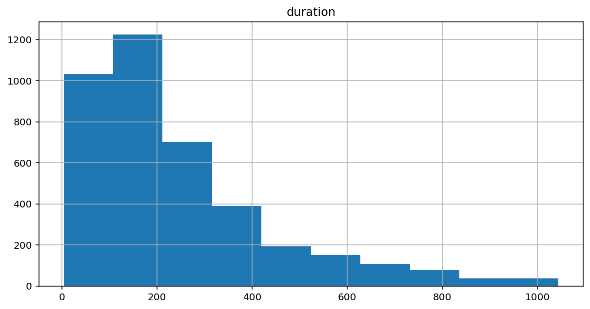


From this histogram it is clear that the last contact duration is highest around between 100 to 200 seconds. After that it was keep on decreasing and almost lowest between 830 to 1000 seconds.
So the most of the phone calls were performed between 100 to 200 seconds.


```python
feature2 = ['balance']
df[feature2].plot(kind='density', subplots=True, layout=(1, 2), 
                  sharex=False, figsize=(10, 5));
```


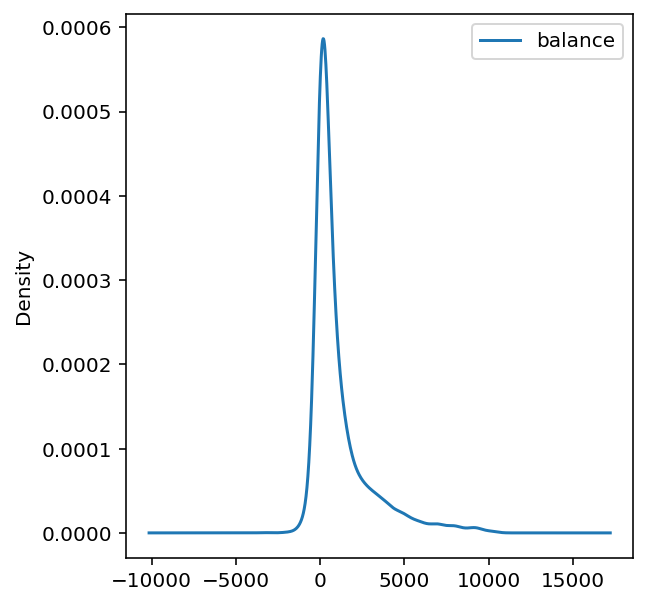


Here the most of clients has account balance between 0 to 2000.
Very less number of clients has account balance is less than 0.


```python
import seaborn as sns
sns.set()

sns.distplot(df['age']);
```


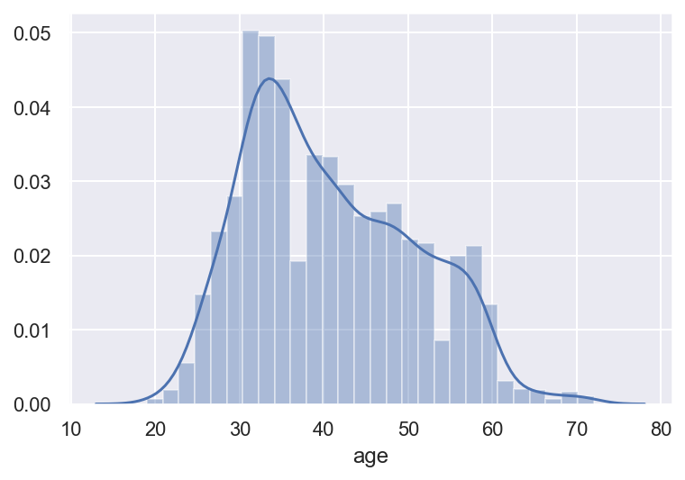


From the density graph it is clear that the bank has large number of clients aged between 30 to 40.
Moderate number of clients are aged between 40 to 60 are connected with the bank.


```python
sns.boxplot(x='age', data=df);
```


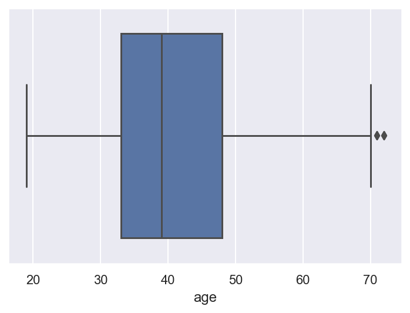


The box plot represents that most of the clients are aged between 33 to 48.
The minimum age is 18 and the maximum age is 70.


```python
plt.figure(figsize=(20,5))
sns.countplot(x='job', hue='y', data=df);
```


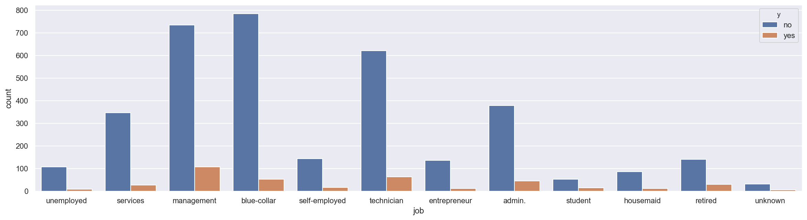


The bar chart shows that most of the clients with blue-collar and management jobs are not subscribed with term deposits.Management employees are highly subscribed with term deposits. 


```python
plt.figure(figsize=(10,5))
sns.countplot(x='campaign', hue='y', data=df);
```


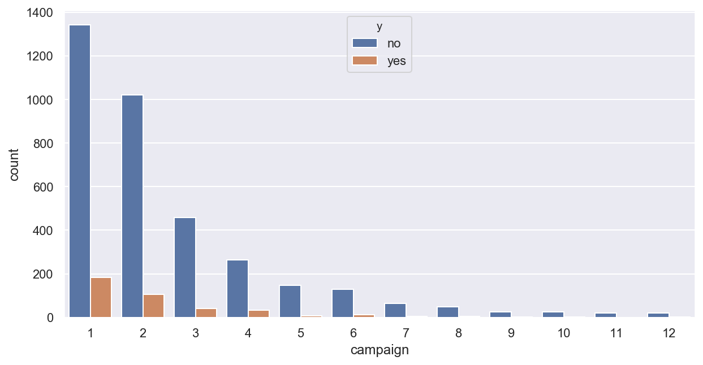


The bar chart shows that campaign 1 and campaign 2 is highly performed but they are almost failed to subscribe the term deposits. 


```python
plt.figure(figsize=(10,5))
sns.countplot(x='marital', hue='y', data=df);
```


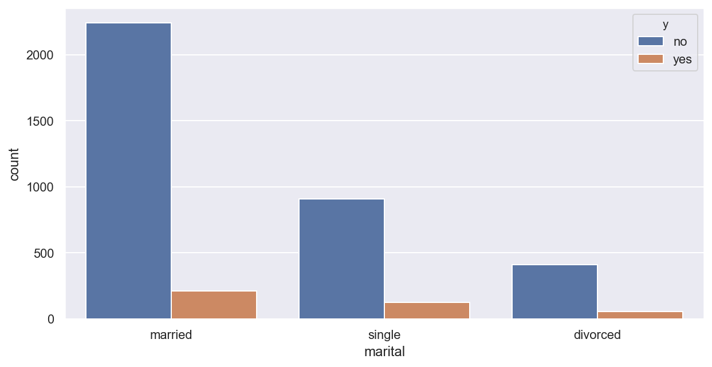


From the graph, it is clear that around 2300  married people do not believe to subscribe to the term deposit and around 250 married people believe to subscribe for term deposits. Very less number of people subscribed with term deposits.


```python
sns.boxplot(x='y', y='duration', data=df);
```


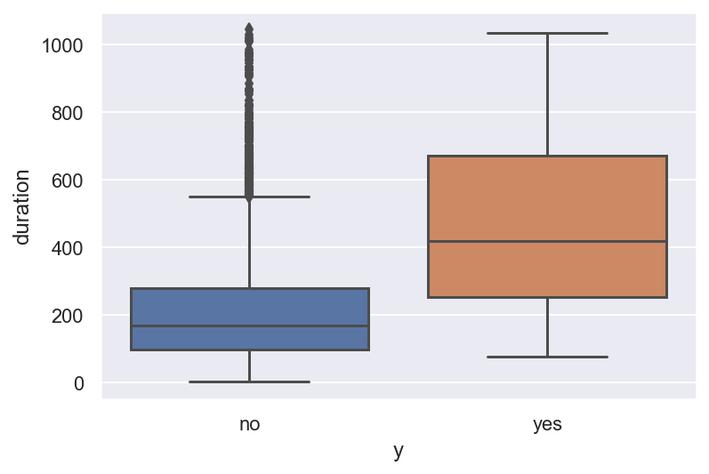


Most of contact duration were made between 100 to 300 seconds for clients who have not subscribed the term deposite.The clients who have subscribed for term deoosite are contacted mostly between 230 to 630 seconds.


```python
plt.figure(figsize=(10,5))
sns.countplot(x='housing', hue='y', data=df);
```


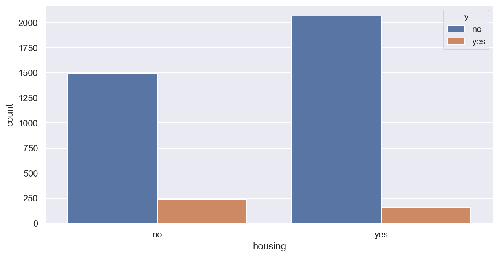


Around 2100 clients have housing loans and they have subscribed for term deposits. 250 clients have subscribed for term deposits did not have housing loans.


```python
plt.figure(figsize=(20,5))
sns.barplot(x="job", y="age", hue="y", data=df)
```


    <Figure size 1440x360 with 0 Axes>


    <matplotlib.axes._subplots.AxesSubplot at 0x7ff6613966d0>


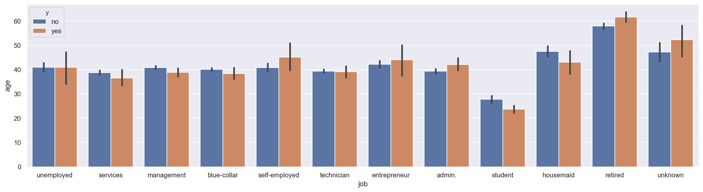


From this bar-plot, it is clear that in both the cases of term deposits almost all the clients are aged between 40 to 50.


```python
sns.catplot(x='y', y='age', col='campaign',
               data=df[df['campaign'] < 8], kind="box",
               col_wrap=7, height=4, aspect=.8);
```


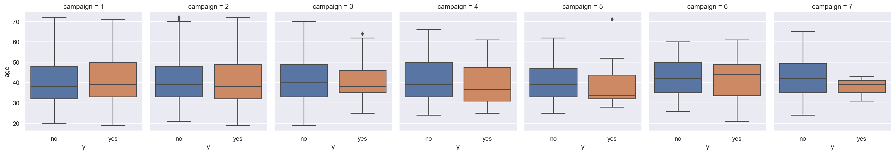


Upper box plots shows that all the campaigns performed for clients who have not subscribed for term deposits are ages between 30 to 50. But in case of subscription of term deposits there is much variation in ages.


```python
sns.relplot(x="campaign", y="age", hue="y", style="y",
            kind="line", data=df);
```


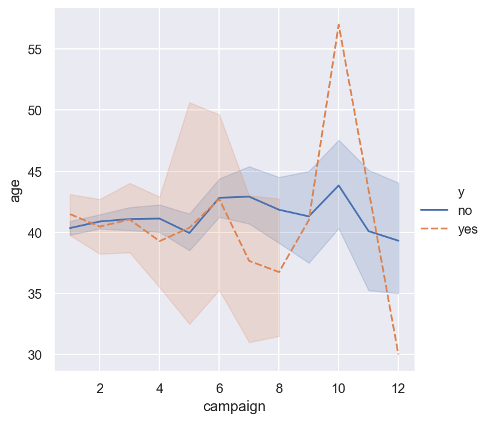


The line graphs for both cases of term deposits are almost similar up to campaign 8 and ages for them are also between 40 to 50. but for campaign 10 both lines are at peak in ages like for subscription of term deposits client is of age 57 and no subscription of term deposits client is of age 47.

# Predictive Modelling

## Methodology

We consider the following (binary) classifiers to predict the target feature:

1.   K-Nearest Neighbors (KNN)
2.   Decision trees (DT)
3.   Naive Bayes (NB)
4.   Support Vector Classification (SVC)

First we have cleaned the dataset. This transformation includes encoding categorical descriptive features as numerical and then scaling of the descriptive features. After that, We split into training and test sets with a ***70:30 ratio***. This way, our training data has **2767 rows** and test data has **1187 rows**. To be clear, our terminology here is that

> **The 2767 rows of data used during the hyperparameter tuning phase is called the training data.
> The 1187 rows of data used during the performance comparison phase is called the test data.**

Before fitting a particular classifier on the training data, we select the best features using the powerful Random Forest Importance method inside a pipeline. We consider **10, 20, and the full set of features (with 48 features)** after encoding of categorical features. Using feature selection together with hyperparameter search inside a single pipeline, we conduct a **5-fold stratified cross-validation** to fine-tune hyperparameters of each classifier using **area under curve (AUC)** as the performance metric. We build each model using parallel processing with **"-2" cores**. **We also examine sensitivity of each model with respect to its hyperparameters during the search.**

Classifiers with the best set of hyperparameter values as identified via grid search using the training data are called tuned classifiers. Once we identify the three tuned classifiers (with the best hyperparameter values), we **"fit" them on the test data using 10-fold cross-validation in a paired fashion and we perform paired t-tests** to see if any performance difference is statistically significant. In addition, **we compare the classifiers with respect to their recall scores and confusion matrices on the test data**.

## Train-Test Splitting

So, we will train and tune our models on 70% rows of training data and we will test them on 30% rows of test data.


```python
# we will Split this dataset into train and test partitions with a 70:30 ratio using stratification.

# Renaming datasets
Data_sample = Data
target_sample = target

Data_sample_train, Data_sample_test, \
target_sample_train, target_sample_test = train_test_split(Data_sample, target_sample, 
                                                    test_size = 0.3, random_state=999,
                                                    stratify = target_sample)

print(Data_sample_train.shape)
print(Data_sample_test.shape)
```

    (2767, 48)
    (1187, 48)


## Model Evaluation Strategy

For each model, we will use 5-fold stratified cross-validation evaluation method (without any repetitions for shorter run times) for hyperparameter tuning.


```python
cv_method = StratifiedKFold(n_splits=5, random_state=999)
```

## Hyperparameter Tuning 


Hyper-parameters are parameters that are not directly learnt within estimators. In sci-kit-learn, they are passed as arguments to the constructor of the estimator classes. 

It is possible and recommended to search the hyper-parameter space for the best cross-validation score. so we will use the Random Forest Importance Feature Selector for that purpose.

Any parameter provided when constructing an estimator may be optimized in this manner.

### Random Forest Importance Feature Selector

For feature selection, we use the powerful Random Forest Importance (RFI) method with 100 estimators. We have made RFI feature selection as part of the pipeline. For this reason, we define the custom RFIFeatureSelector() class below to pass in RFI as a "step" to the pipeline.


```python
# custom function for RFI feature selection inside a pipeline
# here we use n_estimators=100
class RFIFeatureSelector(BaseEstimator, TransformerMixin):
    
    # class constructor 
    # make sure class attributes end with a "_"
    # per scikit-learn convention to avoid errors
    def __init__(self, n_features_=10):
        self.n_features_ = n_features_
        self.fs_indices_ = None

    # override the fit function
    def fit(self, X, y):
        from sklearn.ensemble import RandomForestClassifier
        from numpy import argsort
        model_rfi = RandomForestClassifier(n_estimators=100)
        model_rfi.fit(X, y)
        self.fs_indices_ = argsort(model_rfi.feature_importances_)[::-1][0:self.n_features_] 
        return self 
    
    # override the transform function
    def transform(self, X, y=None):
        return X[:, self.fs_indices_]
```

### Search Result function

This function will return pandas Dataframe of search outputs.


```python
# custom function to format the search results as a Pandas data frame
def get_search_results(gs):

    def model_result(scores, params):
        scores = {'mean_score': np.mean(scores),
             'std_score': np.std(scores),
             'min_score': np.min(scores),
             'max_score': np.max(scores)}
        return pd.Series({**params,**scores})

    models = []
    scores = []

    for i in range(gs.n_splits_):
        key = f"split{i}_test_score"
        r = gs.cv_results_[key]        
        scores.append(r.reshape(-1,1))

    all_scores = np.hstack(scores)
    for p, s in zip(gs.cv_results_['params'], all_scores):
        models.append((model_result(s, p)))

    pipe_results = pd.concat(models, axis=1).T.sort_values(['mean_score'], ascending=False)

    columns_first = ['mean_score', 'std_score', 'max_score', 'min_score']
    columns = columns_first + [c for c in pipe_results.columns if c not in columns_first]

    return pipe_results[columns]
```

### K-Nearest Neighbors (KNN)

Neighbors-based classification is a type of instance-based learning or non-generalizing learning: it does not attempt to construct a general internal model, but simply stores instances of the training data. Classification is computed from a simple majority vote of the nearest neighbors of each point: a query point is assigned the data class which has the most representatives within the nearest neighbors of the point.

KNeighborsClassifier implements learning based on the  nearest neighbors of each query point, where  is an integer value specified by the user.

The -neighbors classification in KNeighborsClassifier is the most commonly used technique. The optimal choice of the value  is highly data-dependent: in general a larger  suppresses the effects of noise, but makes the classification boundaries less distinct.

Here, using Pipeline, we stack feature selection and grid search for KNN hyperparameter tuning via cross-validation. We will use the same Pipeline methodology for NB and DT.

The KNN hyperparameters are as follows:

1.   number of neighbors (n_neighbors) and
2.   the distance metric p.


```python
pipe_KNN = Pipeline(steps=[('rfi_fs', RFIFeatureSelector()), 
                           ('knn', KNeighborsClassifier())])

params_pipe_KNN = {'rfi_fs__n_features_': [10, 20, Data.shape[1]],
                   'knn__n_neighbors': [1, 5, 10, 15, 20],
                   'knn__p': [1, 2]}

gs_pipe_KNN = GridSearchCV(estimator=pipe_KNN, 
                           param_grid=params_pipe_KNN, 
                           cv=cv_method,
                           refit=True,
                           n_jobs=-2,
                           scoring='roc_auc',
                           verbose=1) 
gs_pipe_KNN.fit(Data_sample_train, target_sample_train);
```

    Fitting 5 folds for each of 30 candidates, totalling 150 fits


    [Parallel(n_jobs=-2)]: Using backend LokyBackend with 7 concurrent workers.
    [Parallel(n_jobs=-2)]: Done  36 tasks      | elapsed:    4.6s
    [Parallel(n_jobs=-2)]: Done 150 out of 150 | elapsed:   19.6s finished


```python
gs_pipe_KNN.best_params_
```


    {'knn__n_neighbors': 20, 'knn__p': 2, 'rfi_fs__n_features_': 10}


```python
gs_pipe_KNN.best_score_
```


    0.7989150106630851


We observe that the optimal KNN model has a mean AUC score of 0.813. The best performing KNN selected 10 features with 20 nearest neighbors and  𝑝=1 , which is the Manhattan distance.


```python
results_KNN = get_search_results(gs_pipe_KNN)
results_KNN.head()
```


<div>
<style scoped>
    .dataframe tbody tr th:only-of-type {
        vertical-align: middle;
    }

    .dataframe tbody tr th {
        vertical-align: top;
    }

    .dataframe thead th {
        text-align: right;
    }
</style>
<table border="1" class="dataframe">
  <thead>
    <tr style="text-align: right;">
      <th></th>
      <th>mean_score</th>
      <th>std_score</th>
      <th>max_score</th>
      <th>min_score</th>
      <th>knn__n_neighbors</th>
      <th>knn__p</th>
      <th>rfi_fs__n_features_</th>
    </tr>
  </thead>
  <tbody>
    <tr>
      <th>27</th>
      <td>0.798915</td>
      <td>0.055689</td>
      <td>0.870395</td>
      <td>0.704399</td>
      <td>20.0</td>
      <td>2.0</td>
      <td>10.0</td>
    </tr>
    <tr>
      <th>24</th>
      <td>0.798487</td>
      <td>0.048065</td>
      <td>0.858499</td>
      <td>0.715845</td>
      <td>20.0</td>
      <td>1.0</td>
      <td>10.0</td>
    </tr>
    <tr>
      <th>21</th>
      <td>0.797960</td>
      <td>0.043572</td>
      <td>0.856039</td>
      <td>0.724480</td>
      <td>15.0</td>
      <td>2.0</td>
      <td>10.0</td>
    </tr>
    <tr>
      <th>18</th>
      <td>0.796253</td>
      <td>0.049575</td>
      <td>0.854473</td>
      <td>0.707503</td>
      <td>15.0</td>
      <td>1.0</td>
      <td>10.0</td>
    </tr>
    <tr>
      <th>15</th>
      <td>0.788124</td>
      <td>0.049093</td>
      <td>0.833522</td>
      <td>0.694195</td>
      <td>10.0</td>
      <td>2.0</td>
      <td>10.0</td>
    </tr>
  </tbody>
</table>
</div>


```python
#visualize the results of the grid search corresponding to 10 selected features.

results_KNN_10_features = results_KNN[results_KNN['rfi_fs__n_features_'] == 10.0]

alt.Chart(results_KNN_10_features, 
          title='KNN Performance Comparison with 10 Features'
         ).mark_line(point=True).encode(
    alt.X('knn__n_neighbors', title='Number of Neighbors'),
    alt.Y('mean_score', title='AUC Score', scale=alt.Scale(zero=False)),
    alt.Color('knn__p:N', title='p')
)
```


<div id="altair-viz-f75cdd646a60479e81dd6344d565fe19"></div>
<script type="text/javascript">
  (function(spec, embedOpt){
    let outputDiv = document.currentScript.previousElementSibling;
    if (outputDiv.id !== "altair-viz-f75cdd646a60479e81dd6344d565fe19") {
      outputDiv = document.getElementById("altair-viz-f75cdd646a60479e81dd6344d565fe19");
    }
    const paths = {
      "vega": "https://cdn.jsdelivr.net/npm//vega@5?noext",
      "vega-lib": "https://cdn.jsdelivr.net/npm//vega-lib?noext",
      "vega-lite": "https://cdn.jsdelivr.net/npm//vega-lite@4.8.1?noext",
      "vega-embed": "https://cdn.jsdelivr.net/npm//vega-embed@6?noext",
    };

    function loadScript(lib) {
      return new Promise(function(resolve, reject) {
        var s = document.createElement('script');
        s.src = paths[lib];
        s.async = true;
        s.onload = () => resolve(paths[lib]);
        s.onerror = () => reject(`Error loading script: ${paths[lib]}`);
        document.getElementsByTagName("head")[0].appendChild(s);
      });
    }

    function showError(err) {
      outputDiv.innerHTML = `<div class="error" style="color:red;">${err}</div>`;
      throw err;
    }

    function displayChart(vegaEmbed) {
      vegaEmbed(outputDiv, spec, embedOpt)
        .catch(err => showError(`Javascript Error: ${err.message}<br>This usually means there's a typo in your chart specification. See the javascript console for the full traceback.`));
    }

    if(typeof define === "function" && define.amd) {
      requirejs.config({paths});
      require(["vega-embed"], displayChart, err => showError(`Error loading script: ${err.message}`));
    } else if (typeof vegaEmbed === "function") {
      displayChart(vegaEmbed);
    } else {
      loadScript("vega")
        .then(() => loadScript("vega-lite"))
        .then(() => loadScript("vega-embed"))
        .catch(showError)
        .then(() => displayChart(vegaEmbed));
    }
  })({"config": {"view": {"continuousWidth": 400, "continuousHeight": 300}}, "data": {"name": "data-cf317ddd6722e4ca4e3cc77c2b47a602"}, "mark": {"type": "line", "point": true}, "encoding": {"color": {"type": "nominal", "field": "knn__p", "title": "p"}, "x": {"type": "quantitative", "field": "knn__n_neighbors", "title": "Number of Neighbors"}, "y": {"type": "quantitative", "field": "mean_score", "scale": {"zero": false}, "title": "AUC Score"}}, "title": "KNN Performance Comparison with 10 Features", "$schema": "https://vega.github.io/schema/vega-lite/v4.8.1.json", "datasets": {"data-cf317ddd6722e4ca4e3cc77c2b47a602": [{"mean_score": 0.7989150106630851, "std_score": 0.055688923477414096, "max_score": 0.870395336126799, "min_score": 0.704399415845199, "knn__n_neighbors": 20.0, "knn__p": 2.0, "rfi_fs__n_features_": 10.0}, {"mean_score": 0.7984870158149248, "std_score": 0.048064746834434804, "max_score": 0.8584988158134451, "min_score": 0.715845198977729, "knn__n_neighbors": 20.0, "knn__p": 1.0, "rfi_fs__n_features_": 10.0}, {"mean_score": 0.79796046029018, "std_score": 0.04357244169525789, "max_score": 0.856039351430133, "min_score": 0.7244797371303395, "knn__n_neighbors": 15.0, "knn__p": 2.0, "rfi_fs__n_features_": 10.0}, {"mean_score": 0.7962525432187648, "std_score": 0.04957474521853654, "max_score": 0.8544725815266898, "min_score": 0.7075027382256297, "knn__n_neighbors": 15.0, "knn__p": 1.0, "rfi_fs__n_features_": 10.0}, {"mean_score": 0.788124094523882, "std_score": 0.04909331433583174, "max_score": 0.8335215886318089, "min_score": 0.6941949616648411, "knn__n_neighbors": 10.0, "knn__p": 2.0, "rfi_fs__n_features_": 10.0}, {"mean_score": 0.7741981890843469, "std_score": 0.040106009548732724, "max_score": 0.8292220805246857, "min_score": 0.7054581964220519, "knn__n_neighbors": 10.0, "knn__p": 1.0, "rfi_fs__n_features_": 10.0}, {"mean_score": 0.7424982031728053, "std_score": 0.03623330285554543, "max_score": 0.7796684277646201, "min_score": 0.6749361080686381, "knn__n_neighbors": 5.0, "knn__p": 2.0, "rfi_fs__n_features_": 10.0}, {"mean_score": 0.7391635203391246, "std_score": 0.06538057375535128, "max_score": 0.7887229003461469, "min_score": 0.6097845929171231, "knn__n_neighbors": 5.0, "knn__p": 1.0, "rfi_fs__n_features_": 10.0}, {"mean_score": 0.6105785104751712, "std_score": 0.033224091749677914, "max_score": 0.66585899070869, "min_score": 0.5619021540708288, "knn__n_neighbors": 1.0, "knn__p": 2.0, "rfi_fs__n_features_": 10.0}, {"mean_score": 0.5886089675598815, "std_score": 0.02868203777646935, "max_score": 0.6164693022408453, "min_score": 0.5406535231836437, "knn__n_neighbors": 1.0, "knn__p": 1.0, "rfi_fs__n_features_": 10.0}]}}, {"mode": "vega-lite"});
</script>


### Decision Trees (DT)


Decision Trees (DTs) are a non-parametric supervised learningDecisionTreeClassifier is a class capable of performing multi-class classification on a dataset.

As with other classifiers, DecisionTreeClassifier takes as input two arrays: an array X, sparse or dense, of size [n_samples, n_features] holding the training samples, and an array Y of integer values, size [n_samples], holding the class labels for the training samples: method used for classification and regression. The goal is to create a model that predicts the value of a target variable by learning simple decision rules inferred from the data features.

Here, we build a DT using gini index to maximize information gain. We aim to determine the optimal combinations of maximum depth (max_depth) and minimum sample split (min_samples_split).


```python
pipe_DT = Pipeline([('rfi_fs', RFIFeatureSelector()),
                    ('dt', DecisionTreeClassifier(criterion='gini', random_state=111))])

params_pipe_DT = {'rfi_fs__n_features_': [10, 20, Data.shape[1]],
                  'dt__max_depth': [3, 4, 5],
                  'dt__min_samples_split': [2, 5]}

gs_pipe_DT = GridSearchCV(estimator=pipe_DT, 
                          param_grid=params_pipe_DT, 
                          cv=cv_method,
                          refit=True,
                          n_jobs=-2,
                          scoring='roc_auc',
                          verbose=1) 

gs_pipe_DT.fit(Data_sample_train, target_sample_train);
```

    Fitting 5 folds for each of 18 candidates, totalling 90 fits


    [Parallel(n_jobs=-2)]: Using backend LokyBackend with 7 concurrent workers.
    [Parallel(n_jobs=-2)]: Done  36 tasks      | elapsed:    4.8s
    [Parallel(n_jobs=-2)]: Done  90 out of  90 | elapsed:   10.4s finished


```python
gs_pipe_DT.best_params_
```


    {'dt__max_depth': 4, 'dt__min_samples_split': 5, 'rfi_fs__n_features_': 10}


```python
gs_pipe_DT.best_score_
```


    0.770907767423208


Here, we observe that the optimal DT model has a mean AUC score of 0.778. The best performing DT selected 48 features with samples splits 5 and  max depth of 4.


```python
#visualize the results of the grid search corresponding to 10 selected features.

results_DT = get_search_results(gs_pipe_DT)

results_DT_10_features = results_DT[results_DT['rfi_fs__n_features_'] == 10.0]

alt.Chart(results_DT_10_features, 
          title='DT Performance Comparison with 10 Features'
         ).mark_line(point=True).encode(
    alt.X('dt__min_samples_split', title='Min Samples for Split'),
    alt.Y('mean_score', title='AUC Score', scale=alt.Scale(zero=False)),
    alt.Color('dt__max_depth:N', title='Max Depth')
)
```


<div id="altair-viz-604e25e4d80c48ca82141b038d251c39"></div>
<script type="text/javascript">
  (function(spec, embedOpt){
    let outputDiv = document.currentScript.previousElementSibling;
    if (outputDiv.id !== "altair-viz-604e25e4d80c48ca82141b038d251c39") {
      outputDiv = document.getElementById("altair-viz-604e25e4d80c48ca82141b038d251c39");
    }
    const paths = {
      "vega": "https://cdn.jsdelivr.net/npm//vega@5?noext",
      "vega-lib": "https://cdn.jsdelivr.net/npm//vega-lib?noext",
      "vega-lite": "https://cdn.jsdelivr.net/npm//vega-lite@4.8.1?noext",
      "vega-embed": "https://cdn.jsdelivr.net/npm//vega-embed@6?noext",
    };

    function loadScript(lib) {
      return new Promise(function(resolve, reject) {
        var s = document.createElement('script');
        s.src = paths[lib];
        s.async = true;
        s.onload = () => resolve(paths[lib]);
        s.onerror = () => reject(`Error loading script: ${paths[lib]}`);
        document.getElementsByTagName("head")[0].appendChild(s);
      });
    }

    function showError(err) {
      outputDiv.innerHTML = `<div class="error" style="color:red;">${err}</div>`;
      throw err;
    }

    function displayChart(vegaEmbed) {
      vegaEmbed(outputDiv, spec, embedOpt)
        .catch(err => showError(`Javascript Error: ${err.message}<br>This usually means there's a typo in your chart specification. See the javascript console for the full traceback.`));
    }

    if(typeof define === "function" && define.amd) {
      requirejs.config({paths});
      require(["vega-embed"], displayChart, err => showError(`Error loading script: ${err.message}`));
    } else if (typeof vegaEmbed === "function") {
      displayChart(vegaEmbed);
    } else {
      loadScript("vega")
        .then(() => loadScript("vega-lite"))
        .then(() => loadScript("vega-embed"))
        .catch(showError)
        .then(() => displayChart(vegaEmbed));
    }
  })({"config": {"view": {"continuousWidth": 400, "continuousHeight": 300}}, "data": {"name": "data-924570dd76938d2045dfff3bc0d7764b"}, "mark": {"type": "line", "point": true}, "encoding": {"color": {"type": "nominal", "field": "dt__max_depth", "title": "Max Depth"}, "x": {"type": "quantitative", "field": "dt__min_samples_split", "title": "Min Samples for Split"}, "y": {"type": "quantitative", "field": "mean_score", "scale": {"zero": false}, "title": "AUC Score"}}, "title": "DT Performance Comparison with 10 Features", "$schema": "https://vega.github.io/schema/vega-lite/v4.8.1.json", "datasets": {"data-924570dd76938d2045dfff3bc0d7764b": [{"mean_score": 0.770907767423208, "std_score": 0.057729509846735944, "max_score": 0.8423574421570413, "min_score": 0.7019167579408543, "dt__max_depth": 4.0, "dt__min_samples_split": 5.0, "rfi_fs__n_features_": 10.0}, {"mean_score": 0.767473590644028, "std_score": 0.06214579792178986, "max_score": 0.8423574421570413, "min_score": 0.6843190945600583, "dt__max_depth": 4.0, "dt__min_samples_split": 2.0, "rfi_fs__n_features_": 10.0}, {"mean_score": 0.7644889820206717, "std_score": 0.039271825753223244, "max_score": 0.8054290398979776, "min_score": 0.6912559328221978, "dt__max_depth": 3.0, "dt__min_samples_split": 5.0, "rfi_fs__n_features_": 10.0}, {"mean_score": 0.7644630041389825, "std_score": 0.039272582339276524, "max_score": 0.8054290398979776, "min_score": 0.6912559328221978, "dt__max_depth": 3.0, "dt__min_samples_split": 2.0, "rfi_fs__n_features_": 10.0}, {"mean_score": 0.7419395205973182, "std_score": 0.059138663243378194, "max_score": 0.8407906722535979, "min_score": 0.6564439576487769, "dt__max_depth": 5.0, "dt__min_samples_split": 5.0, "rfi_fs__n_features_": 10.0}, {"mean_score": 0.7271847260298862, "std_score": 0.07226759654954862, "max_score": 0.8404991801785389, "min_score": 0.6430631617378606, "dt__max_depth": 5.0, "dt__min_samples_split": 2.0, "rfi_fs__n_features_": 10.0}]}}, {"mode": "vega-lite"});
</script>


### (Gaussian) Naive Bayes (NB)

Naive Bayes methods are a set of supervised learning algorithms based on applying Bayes’ theorem with the “naive” assumption of conditional independence between every pair of features given the value of the class variable.

GaussianNB implements the Gaussian Naive Bayes algorithm for classification. We optimize var_smoothing (a variant of Laplace smoothing) as we do not have any prior information about our dataset. By default, the var_smoothing parameter's value is  10^−9  . We conduct the grid search in the logspace (over the powers of 10) sourced from NumPy. We start with 10 and end with  10^-3  with 200 different values, but we perform a random search over only 20 different values (for shorter run times). Since NB requires each descriptive feature to follow a Gaussian distribution, we first perform a power transformation on the input data before model fitting.


```python
Data_sample_train_transformed = PowerTransformer().fit_transform(Data_sample_train)

pipe_NB = Pipeline([('rfi_fs', RFIFeatureSelector()), 
                     ('nb', GaussianNB())])

params_pipe_NB = {'rfi_fs__n_features_': [10, 20, Data.shape[1]],
                  'nb__var_smoothing': np.logspace(1,-3, num=200)}

n_iter_search = 20
gs_pipe_NB = RandomizedSearchCV(estimator=pipe_NB, 
                          param_distributions=params_pipe_NB, 
                          cv=cv_method,
                          refit=True,
                          n_jobs=-2,
                          scoring='roc_auc',
                          n_iter=n_iter_search,
                          verbose=1) 

gs_pipe_NB.fit(Data_sample_train_transformed, target_sample_train);
```

    Fitting 5 folds for each of 20 candidates, totalling 100 fits


    [Parallel(n_jobs=-2)]: Using backend LokyBackend with 7 concurrent workers.
    [Parallel(n_jobs=-2)]: Done  36 tasks      | elapsed:    4.6s
    [Parallel(n_jobs=-2)]: Done 100 out of 100 | elapsed:   11.0s finished


```python
gs_pipe_NB.best_params_
```


    {'rfi_fs__n_features_': 10, 'nb__var_smoothing': 5.231099308056262}


```python
gs_pipe_NB.best_score_
```


    0.8370825477168283


Here, the optimal NB model has a mean AUC score of 0.847. The best performing NB selected 10 features with variable smoothing of 3.612.


```python
results_NB = get_search_results(gs_pipe_NB)
results_NB.head()
```


<div>
<style scoped>
    .dataframe tbody tr th:only-of-type {
        vertical-align: middle;
    }

    .dataframe tbody tr th {
        vertical-align: top;
    }

    .dataframe thead th {
        text-align: right;
    }
</style>
<table border="1" class="dataframe">
  <thead>
    <tr style="text-align: right;">
      <th></th>
      <th>mean_score</th>
      <th>std_score</th>
      <th>max_score</th>
      <th>min_score</th>
      <th>rfi_fs__n_features_</th>
      <th>nb__var_smoothing</th>
    </tr>
  </thead>
  <tbody>
    <tr>
      <th>2</th>
      <td>0.837083</td>
      <td>0.037431</td>
      <td>0.878849</td>
      <td>0.787623</td>
      <td>10.0</td>
      <td>5.231099</td>
    </tr>
    <tr>
      <th>0</th>
      <td>0.826501</td>
      <td>0.029104</td>
      <td>0.856203</td>
      <td>0.785089</td>
      <td>10.0</td>
      <td>0.123155</td>
    </tr>
    <tr>
      <th>8</th>
      <td>0.826139</td>
      <td>0.025448</td>
      <td>0.855377</td>
      <td>0.784495</td>
      <td>10.0</td>
      <td>0.077526</td>
    </tr>
    <tr>
      <th>19</th>
      <td>0.820839</td>
      <td>0.029061</td>
      <td>0.867426</td>
      <td>0.783938</td>
      <td>10.0</td>
      <td>0.026738</td>
    </tr>
    <tr>
      <th>18</th>
      <td>0.816080</td>
      <td>0.015894</td>
      <td>0.832119</td>
      <td>0.787976</td>
      <td>20.0</td>
      <td>0.748810</td>
    </tr>
  </tbody>
</table>
</div>


```python
#visualize the results of the grid search corresponding to 10 selected features.

results_NB_10_features = results_NB[results_NB['rfi_fs__n_features_'] == 10.0]

alt.Chart(results_NB_10_features, 
          title='NB Performance Comparison with 10 Features'
         ).mark_line(point=True).encode(
    alt.X('nb__var_smoothing', title='Var. Smoothing'),
    alt.Y('mean_score', title='AUC Score', scale=alt.Scale(zero=False))
)
```


<div id="altair-viz-f626b9fafb784ab7b948848e71e6c073"></div>
<script type="text/javascript">
  (function(spec, embedOpt){
    let outputDiv = document.currentScript.previousElementSibling;
    if (outputDiv.id !== "altair-viz-f626b9fafb784ab7b948848e71e6c073") {
      outputDiv = document.getElementById("altair-viz-f626b9fafb784ab7b948848e71e6c073");
    }
    const paths = {
      "vega": "https://cdn.jsdelivr.net/npm//vega@5?noext",
      "vega-lib": "https://cdn.jsdelivr.net/npm//vega-lib?noext",
      "vega-lite": "https://cdn.jsdelivr.net/npm//vega-lite@4.8.1?noext",
      "vega-embed": "https://cdn.jsdelivr.net/npm//vega-embed@6?noext",
    };

    function loadScript(lib) {
      return new Promise(function(resolve, reject) {
        var s = document.createElement('script');
        s.src = paths[lib];
        s.async = true;
        s.onload = () => resolve(paths[lib]);
        s.onerror = () => reject(`Error loading script: ${paths[lib]}`);
        document.getElementsByTagName("head")[0].appendChild(s);
      });
    }

    function showError(err) {
      outputDiv.innerHTML = `<div class="error" style="color:red;">${err}</div>`;
      throw err;
    }

    function displayChart(vegaEmbed) {
      vegaEmbed(outputDiv, spec, embedOpt)
        .catch(err => showError(`Javascript Error: ${err.message}<br>This usually means there's a typo in your chart specification. See the javascript console for the full traceback.`));
    }

    if(typeof define === "function" && define.amd) {
      requirejs.config({paths});
      require(["vega-embed"], displayChart, err => showError(`Error loading script: ${err.message}`));
    } else if (typeof vegaEmbed === "function") {
      displayChart(vegaEmbed);
    } else {
      loadScript("vega")
        .then(() => loadScript("vega-lite"))
        .then(() => loadScript("vega-embed"))
        .catch(showError)
        .then(() => displayChart(vegaEmbed));
    }
  })({"config": {"view": {"continuousWidth": 400, "continuousHeight": 300}}, "data": {"name": "data-d4e1b23d5df5b95eb5629c930fde3492"}, "mark": {"type": "line", "point": true}, "encoding": {"x": {"type": "quantitative", "field": "nb__var_smoothing", "title": "Var. Smoothing"}, "y": {"type": "quantitative", "field": "mean_score", "scale": {"zero": false}, "title": "AUC Score"}}, "title": "NB Performance Comparison with 10 Features", "$schema": "https://vega.github.io/schema/vega-lite/v4.8.1.json", "datasets": {"data-d4e1b23d5df5b95eb5629c930fde3492": [{"mean_score": 0.8370825477168283, "std_score": 0.03743085843053099, "max_score": 0.8788486063035161, "min_score": 0.7876232201533406, "rfi_fs__n_features_": 10.0, "nb__var_smoothing": 5.231099308056262}, {"mean_score": 0.8265014341693, "std_score": 0.029104200169776263, "max_score": 0.8562033157223538, "min_score": 0.7850886959103391, "rfi_fs__n_features_": 10.0, "nb__var_smoothing": 0.12315506032928256}, {"mean_score": 0.8261390478006844, "std_score": 0.025448080879968804, "max_score": 0.855377421509686, "min_score": 0.7844949157574408, "rfi_fs__n_features_": 10.0, "nb__var_smoothing": 0.07752597488629465}, {"mean_score": 0.8208388981931247, "std_score": 0.029060516539325364, "max_score": 0.8674257606121334, "min_score": 0.7839382468640985, "rfi_fs__n_features_": 10.0, "nb__var_smoothing": 0.026738416158399468}]}}, {"mode": "vega-lite"});
</script>


### Support Vector Classification

Support vector machines (SVMs) are a set of supervised learning methods used for classification, regression and outliers detection.

As other classifiers, SVC take as input two arrays: an array X of shape (n_samples, n_features) holding the training samples, and an array y of class labels (strings or integers), of shape (n_samples):

Hyper-parameters of Support Vector Classifier are includes C, kernel and gamma.

C is the penalty parameter of the error term. It controls the trade off between smooth decision boundary and classifying the training points correctly.

Here we will use Hyper-parameters as following, C = [0.1, 1, 10], gamma = [0.001, 0.0001], kernel = ['rbf'] and class weight =['balanced', None].


```python
pipe_SVC = Pipeline([('rfi_fs', RFIFeatureSelector()),
                    ('svc', SVC(random_state=0))])

params_pipe_SVC = {
                  'rfi_fs__n_features_': [10, 20, Data.shape[1]],
                  'svc__C': [0.1, 1, 10], 
                   'svc__gamma': [0.001, 0.0001], 
                   'svc__kernel': ['rbf'],
                  'svc__class_weight':['balanced', None]
                  }

gs_pipe_SVC = GridSearchCV(estimator=pipe_SVC, 
                          param_grid=params_pipe_SVC, 
                          cv=cv_method,
                          refit=True,
                          n_jobs=-2,
                          scoring='roc_auc',
                          verbose=1) 

gs_pipe_SVC.fit(Data_sample_train, target_sample_train);
```

    Fitting 5 folds for each of 36 candidates, totalling 180 fits


    [Parallel(n_jobs=-2)]: Using backend LokyBackend with 7 concurrent workers.
    [Parallel(n_jobs=-2)]: Done  36 tasks      | elapsed:    5.7s
    [Parallel(n_jobs=-2)]: Done 180 out of 180 | elapsed:   23.0s finished


```python
results_svc = get_search_results(gs_pipe_SVC)
results_svc.head()
```


<div>
<style scoped>
    .dataframe tbody tr th:only-of-type {
        vertical-align: middle;
    }

    .dataframe tbody tr th {
        vertical-align: top;
    }

    .dataframe thead th {
        text-align: right;
    }
</style>
<table border="1" class="dataframe">
  <thead>
    <tr style="text-align: right;">
      <th></th>
      <th>mean_score</th>
      <th>std_score</th>
      <th>max_score</th>
      <th>min_score</th>
      <th>rfi_fs__n_features_</th>
      <th>svc__C</th>
      <th>svc__class_weight</th>
      <th>svc__gamma</th>
      <th>svc__kernel</th>
    </tr>
  </thead>
  <tbody>
    <tr>
      <th>32</th>
      <td>0.882098</td>
      <td>0.0197173</td>
      <td>0.916378</td>
      <td>0.856042</td>
      <td>48</td>
      <td>10</td>
      <td>balanced</td>
      <td>0.001</td>
      <td>rbf</td>
    </tr>
    <tr>
      <th>35</th>
      <td>0.870852</td>
      <td>0.031013</td>
      <td>0.894371</td>
      <td>0.809821</td>
      <td>48</td>
      <td>10</td>
      <td>None</td>
      <td>0.0001</td>
      <td>rbf</td>
    </tr>
    <tr>
      <th>34</th>
      <td>0.869143</td>
      <td>0.0279777</td>
      <td>0.901111</td>
      <td>0.819095</td>
      <td>48</td>
      <td>10</td>
      <td>None</td>
      <td>0.001</td>
      <td>rbf</td>
    </tr>
    <tr>
      <th>20</th>
      <td>0.867886</td>
      <td>0.0210874</td>
      <td>0.906249</td>
      <td>0.846258</td>
      <td>20</td>
      <td>10</td>
      <td>balanced</td>
      <td>0.001</td>
      <td>rbf</td>
    </tr>
    <tr>
      <th>30</th>
      <td>0.867672</td>
      <td>0.0266754</td>
      <td>0.886464</td>
      <td>0.81475</td>
      <td>48</td>
      <td>1</td>
      <td>None</td>
      <td>0.001</td>
      <td>rbf</td>
    </tr>
  </tbody>
</table>
</div>


```python
gs_pipe_SVC.best_params_
```


    {'rfi_fs__n_features_': 48,
     'svc__C': 10,
     'svc__class_weight': 'balanced',
     'svc__gamma': 0.001,
     'svc__kernel': 'rbf'}


```python
gs_pipe_SVC.best_score_
```


    0.8820975885485627


Here, the optimal SVC model has a mean AUC score of 0.882. The best performing SVC selected 48 features with C value of 10, balanced class weight, gamma is 0.001 and rbf as kernal.


```python
#visualize the results of the grid search corresponding to 10 selected features.

results_SVC = get_search_results(gs_pipe_SVC)

results_SVC_10_features = results_SVC[results_SVC['rfi_fs__n_features_'] == 10.0]

alt.Chart(results_SVC_10_features, 
          title='SVC Performance Comparison with 10 Features'
         ).mark_line(point=True).encode(
    alt.X('svc__C', title='C Samples for Split'),
    alt.Y('mean_score', title='AUC Score', scale=alt.Scale(zero=False))
)
```


<div id="altair-viz-d64744b098064c4488fcf80d751ddfc2"></div>
<script type="text/javascript">
  (function(spec, embedOpt){
    let outputDiv = document.currentScript.previousElementSibling;
    if (outputDiv.id !== "altair-viz-d64744b098064c4488fcf80d751ddfc2") {
      outputDiv = document.getElementById("altair-viz-d64744b098064c4488fcf80d751ddfc2");
    }
    const paths = {
      "vega": "https://cdn.jsdelivr.net/npm//vega@5?noext",
      "vega-lib": "https://cdn.jsdelivr.net/npm//vega-lib?noext",
      "vega-lite": "https://cdn.jsdelivr.net/npm//vega-lite@4.8.1?noext",
      "vega-embed": "https://cdn.jsdelivr.net/npm//vega-embed@6?noext",
    };

    function loadScript(lib) {
      return new Promise(function(resolve, reject) {
        var s = document.createElement('script');
        s.src = paths[lib];
        s.async = true;
        s.onload = () => resolve(paths[lib]);
        s.onerror = () => reject(`Error loading script: ${paths[lib]}`);
        document.getElementsByTagName("head")[0].appendChild(s);
      });
    }

    function showError(err) {
      outputDiv.innerHTML = `<div class="error" style="color:red;">${err}</div>`;
      throw err;
    }

    function displayChart(vegaEmbed) {
      vegaEmbed(outputDiv, spec, embedOpt)
        .catch(err => showError(`Javascript Error: ${err.message}<br>This usually means there's a typo in your chart specification. See the javascript console for the full traceback.`));
    }

    if(typeof define === "function" && define.amd) {
      requirejs.config({paths});
      require(["vega-embed"], displayChart, err => showError(`Error loading script: ${err.message}`));
    } else if (typeof vegaEmbed === "function") {
      displayChart(vegaEmbed);
    } else {
      loadScript("vega")
        .then(() => loadScript("vega-lite"))
        .then(() => loadScript("vega-embed"))
        .catch(showError)
        .then(() => displayChart(vegaEmbed));
    }
  })({"config": {"view": {"continuousWidth": 400, "continuousHeight": 300}}, "data": {"name": "data-55bf20eefca39b7f4f86d3d5b9599d37"}, "mark": {"type": "line", "point": true}, "encoding": {"x": {"type": "quantitative", "field": "svc__C", "title": "C Samples for Split"}, "y": {"type": "quantitative", "field": "mean_score", "scale": {"zero": false}, "title": "AUC Score"}}, "title": "SVC Performance Comparison with 10 Features", "$schema": "https://vega.github.io/schema/vega-lite/v4.8.1.json", "datasets": {"data-55bf20eefca39b7f4f86d3d5b9599d37": [{"mean_score": 0.8525570422009082, "std_score": 0.02817721969773495, "max_score": 0.8885042812898525, "min_score": 0.8089448703906534, "rfi_fs__n_features_": 10, "svc__C": 10, "svc__class_weight": "balanced", "svc__gamma": 0.001, "svc__kernel": "rbf"}, {"mean_score": 0.8269007708329725, "std_score": 0.014425774612162197, "max_score": 0.8459464383312079, "min_score": 0.8019350127783863, "rfi_fs__n_features_": 10, "svc__C": 0.1, "svc__class_weight": null, "svc__gamma": 0.001, "svc__kernel": "rbf"}, {"mean_score": 0.8195062909885327, "std_score": 0.03772416698763951, "max_score": 0.8830752413918747, "min_score": 0.7668492150419861, "rfi_fs__n_features_": 10, "svc__C": 0.1, "svc__class_weight": null, "svc__gamma": 0.0001, "svc__kernel": "rbf"}, {"mean_score": 0.8174384694910083, "std_score": 0.045621129580908255, "max_score": 0.8836217890326107, "min_score": 0.7514056224899598, "rfi_fs__n_features_": 10, "svc__C": 1, "svc__class_weight": null, "svc__gamma": 0.0001, "svc__kernel": "rbf"}, {"mean_score": 0.7823678398133331, "std_score": 0.03127021895138799, "max_score": 0.8233875157722853, "min_score": 0.7478276743336983, "rfi_fs__n_features_": 10, "svc__C": 1, "svc__class_weight": "balanced", "svc__gamma": 0.0001, "svc__kernel": "rbf"}, {"mean_score": 0.7820100449977071, "std_score": 0.03167104744189974, "max_score": 0.8233875157722853, "min_score": 0.7460387002555677, "rfi_fs__n_features_": 10, "svc__C": 10, "svc__class_weight": "balanced", "svc__gamma": 0.0001, "svc__kernel": "rbf"}, {"mean_score": 0.7818152080397052, "std_score": 0.08936813904498815, "max_score": 0.8587720896338131, "min_score": 0.6080686381891202, "rfi_fs__n_features_": 10, "svc__C": 10, "svc__class_weight": null, "svc__gamma": 0.0001, "svc__kernel": "rbf"}, {"mean_score": 0.7796640735936194, "std_score": 0.032590173290967604, "max_score": 0.8195279447784459, "min_score": 0.7460387002555677, "rfi_fs__n_features_": 10, "svc__C": 0.1, "svc__class_weight": "balanced", "svc__gamma": 0.0001, "svc__kernel": "rbf"}, {"mean_score": 0.776405292024965, "std_score": 0.03179868341168386, "max_score": 0.8158910413419431, "min_score": 0.7392844103687477, "rfi_fs__n_features_": 10, "svc__C": 0.1, "svc__class_weight": "balanced", "svc__gamma": 0.001, "svc__kernel": "rbf"}, {"mean_score": 0.7757166419976377, "std_score": 0.035246762528278706, "max_score": 0.8234246270318415, "min_score": 0.7392844103687477, "rfi_fs__n_features_": 10, "svc__C": 1, "svc__class_weight": "balanced", "svc__gamma": 0.001, "svc__kernel": "rbf"}, {"mean_score": 0.7535372086918553, "std_score": 0.027882812990780145, "max_score": 0.7930770632173437, "min_score": 0.7140562248995984, "rfi_fs__n_features_": 10, "svc__C": 1, "svc__class_weight": null, "svc__gamma": 0.001, "svc__kernel": "rbf"}, {"mean_score": 0.7403100907912942, "std_score": 0.018270136469868293, "max_score": 0.7620695937329204, "min_score": 0.7067954089998177, "rfi_fs__n_features_": 10, "svc__C": 10, "svc__class_weight": null, "svc__gamma": 0.001, "svc__kernel": "rbf"}]}}, {"mode": "vega-lite"});
</script>


# Performance Tuning

Here we get maximum accuracy from SVC model but we can see that maximum values lies in extreme end of its search space. Thus, we need to go beyond what we already tried to make sure that we are not missing out on even better values. For this reason, we try a new search as below.


```python
pipe_SVC2 = Pipeline([('rfi_fs', RFIFeatureSelector()),
                    ('svc', SVC(random_state=0))])

params_pipe_SVC2 = {
                  'rfi_fs__n_features_': [10],
                  'svc__C': [0.1, 1, 10, 100, 1000], 
                   'svc__gamma': [0.1, 0.01, 0.001], 
                   'svc__kernel': ['rbf'],
                  'svc__class_weight':['balanced', None]
                  }

gs_pipe_SVC2 = GridSearchCV(estimator=pipe_SVC2, 
                          param_grid=params_pipe_SVC2, 
                          cv=cv_method,
                          refit=True,
                          n_jobs=-2,
                          scoring='roc_auc',
                          verbose=1) 

gs_pipe_SVC2.fit(Data_sample_train, target_sample_train);
```

    Fitting 5 folds for each of 30 candidates, totalling 150 fits


    [Parallel(n_jobs=-2)]: Using backend LokyBackend with 7 concurrent workers.
    [Parallel(n_jobs=-2)]: Done  36 tasks      | elapsed:    3.2s
    [Parallel(n_jobs=-2)]: Done 150 out of 150 | elapsed:   14.2s finished


```python
gs_pipe_SVC2.best_params_
```


    {'rfi_fs__n_features_': 10,
     'svc__C': 1000,
     'svc__class_weight': 'balanced',
     'svc__gamma': 0.01,
     'svc__kernel': 'rbf'}


```python
gs_pipe_SVC2.best_score_
```


    0.8583028049527313


Here, using new parameters on fix 10 features has decreased our accuracy of SVC from 0.882 to 0.859, which means working with 10 features is not preferable and we required more features to working with.


```python
results_svc2 = get_search_results(gs_pipe_SVC2)
results_svc2.head()
```


<div>
<style scoped>
    .dataframe tbody tr th:only-of-type {
        vertical-align: middle;
    }

    .dataframe tbody tr th {
        vertical-align: top;
    }

    .dataframe thead th {
        text-align: right;
    }
</style>
<table border="1" class="dataframe">
  <thead>
    <tr style="text-align: right;">
      <th></th>
      <th>mean_score</th>
      <th>std_score</th>
      <th>max_score</th>
      <th>min_score</th>
      <th>rfi_fs__n_features_</th>
      <th>svc__C</th>
      <th>svc__class_weight</th>
      <th>svc__gamma</th>
      <th>svc__kernel</th>
    </tr>
  </thead>
  <tbody>
    <tr>
      <th>25</th>
      <td>0.858303</td>
      <td>0.0367033</td>
      <td>0.906868</td>
      <td>0.807923</td>
      <td>10</td>
      <td>1000</td>
      <td>balanced</td>
      <td>0.01</td>
      <td>rbf</td>
    </tr>
    <tr>
      <th>19</th>
      <td>0.857146</td>
      <td>0.0290556</td>
      <td>0.901949</td>
      <td>0.824498</td>
      <td>10</td>
      <td>100</td>
      <td>balanced</td>
      <td>0.01</td>
      <td>rbf</td>
    </tr>
    <tr>
      <th>6</th>
      <td>0.856564</td>
      <td>0.0336213</td>
      <td>0.902532</td>
      <td>0.808872</td>
      <td>10</td>
      <td>1</td>
      <td>balanced</td>
      <td>0.1</td>
      <td>rbf</td>
    </tr>
    <tr>
      <th>13</th>
      <td>0.856053</td>
      <td>0.0318728</td>
      <td>0.900783</td>
      <td>0.812267</td>
      <td>10</td>
      <td>10</td>
      <td>balanced</td>
      <td>0.01</td>
      <td>rbf</td>
    </tr>
    <tr>
      <th>26</th>
      <td>0.855715</td>
      <td>0.0335983</td>
      <td>0.900601</td>
      <td>0.814494</td>
      <td>10</td>
      <td>1000</td>
      <td>balanced</td>
      <td>0.001</td>
      <td>rbf</td>
    </tr>
  </tbody>
</table>
</div>


We again observe that the cross-validated AUC score difference between the hyperparameter combinations is less than original value in this case. A visualization of the new search results is shown below.


```python
#visualize the results of the grid search corresponding to 10 selected features.

results_SVC2 = get_search_results(gs_pipe_SVC2)

results_SVC2_10_features = results_SVC2[results_SVC2['rfi_fs__n_features_'] == 10.0]

alt.Chart(results_SVC2_10_features, 
          title='SVC Performance Comparison with 10 Features'
         ).mark_line(point=True).encode(
    alt.X('svc__C', title='C Samples for Split'),
    alt.Y('mean_score', title='AUC Score', scale=alt.Scale(zero=False))
)
```


<div id="altair-viz-0335fd3656d040e7a76cd0911ac4d684"></div>
<script type="text/javascript">
  (function(spec, embedOpt){
    let outputDiv = document.currentScript.previousElementSibling;
    if (outputDiv.id !== "altair-viz-0335fd3656d040e7a76cd0911ac4d684") {
      outputDiv = document.getElementById("altair-viz-0335fd3656d040e7a76cd0911ac4d684");
    }
    const paths = {
      "vega": "https://cdn.jsdelivr.net/npm//vega@5?noext",
      "vega-lib": "https://cdn.jsdelivr.net/npm//vega-lib?noext",
      "vega-lite": "https://cdn.jsdelivr.net/npm//vega-lite@4.8.1?noext",
      "vega-embed": "https://cdn.jsdelivr.net/npm//vega-embed@6?noext",
    };

    function loadScript(lib) {
      return new Promise(function(resolve, reject) {
        var s = document.createElement('script');
        s.src = paths[lib];
        s.async = true;
        s.onload = () => resolve(paths[lib]);
        s.onerror = () => reject(`Error loading script: ${paths[lib]}`);
        document.getElementsByTagName("head")[0].appendChild(s);
      });
    }

    function showError(err) {
      outputDiv.innerHTML = `<div class="error" style="color:red;">${err}</div>`;
      throw err;
    }

    function displayChart(vegaEmbed) {
      vegaEmbed(outputDiv, spec, embedOpt)
        .catch(err => showError(`Javascript Error: ${err.message}<br>This usually means there's a typo in your chart specification. See the javascript console for the full traceback.`));
    }

    if(typeof define === "function" && define.amd) {
      requirejs.config({paths});
      require(["vega-embed"], displayChart, err => showError(`Error loading script: ${err.message}`));
    } else if (typeof vegaEmbed === "function") {
      displayChart(vegaEmbed);
    } else {
      loadScript("vega")
        .then(() => loadScript("vega-lite"))
        .then(() => loadScript("vega-embed"))
        .catch(showError)
        .then(() => displayChart(vegaEmbed));
    }
  })({"config": {"view": {"continuousWidth": 400, "continuousHeight": 300}}, "data": {"name": "data-69f47082880e8c25bd2bd108a5e56e91"}, "mark": {"type": "line", "point": true}, "encoding": {"x": {"type": "quantitative", "field": "svc__C", "title": "C Samples for Split"}, "y": {"type": "quantitative", "field": "mean_score", "scale": {"zero": false}, "title": "AUC Score"}}, "title": "SVC Performance Comparison with 10 Features", "$schema": "https://vega.github.io/schema/vega-lite/v4.8.1.json", "datasets": {"data-69f47082880e8c25bd2bd108a5e56e91": [{"mean_score": 0.8583028049527313, "std_score": 0.0367033466505812, "max_score": 0.9068682820185825, "min_score": 0.8079225994888646, "rfi_fs__n_features_": 10, "svc__C": 1000, "svc__class_weight": "balanced", "svc__gamma": 0.01, "svc__kernel": "rbf"}, {"mean_score": 0.8571459091969993, "std_score": 0.029055623974824144, "max_score": 0.9019493532519585, "min_score": 0.8244979919678714, "rfi_fs__n_features_": 10, "svc__C": 100, "svc__class_weight": "balanced", "svc__gamma": 0.01, "svc__kernel": "rbf"}, {"mean_score": 0.8565640843164564, "std_score": 0.03362125561992178, "max_score": 0.9025323374020768, "min_score": 0.8088718510405257, "rfi_fs__n_features_": 10, "svc__C": 1, "svc__class_weight": "balanced", "svc__gamma": 0.1, "svc__kernel": "rbf"}, {"mean_score": 0.8560533098162575, "std_score": 0.03187275728845812, "max_score": 0.9007833849517216, "min_score": 0.8122672508214677, "rfi_fs__n_features_": 10, "svc__C": 10, "svc__class_weight": "balanced", "svc__gamma": 0.01, "svc__kernel": "rbf"}, {"mean_score": 0.855715342900315, "std_score": 0.03359831410915545, "max_score": 0.9006012024048096, "min_score": 0.8144943410003651, "rfi_fs__n_features_": 10, "svc__C": 1000, "svc__class_weight": "balanced", "svc__gamma": 0.001, "svc__kernel": "rbf"}, {"mean_score": 0.8555067312833448, "std_score": 0.03534191676856902, "max_score": 0.9051922025869922, "min_score": 0.8078130704636729, "rfi_fs__n_features_": 10, "svc__C": 10, "svc__class_weight": "balanced", "svc__gamma": 0.1, "svc__kernel": "rbf"}, {"mean_score": 0.8527663090572041, "std_score": 0.029221357673649393, "max_score": 0.8934232100564765, "min_score": 0.8115370573201899, "rfi_fs__n_features_": 10, "svc__C": 100, "svc__class_weight": "balanced", "svc__gamma": 0.001, "svc__kernel": "rbf"}, {"mean_score": 0.8523702030648452, "std_score": 0.025396944232469992, "max_score": 0.891637821096739, "min_score": 0.8188755020080322, "rfi_fs__n_features_": 10, "svc__C": 0.1, "svc__class_weight": "balanced", "svc__gamma": 0.1, "svc__kernel": "rbf"}, {"mean_score": 0.8522801247296019, "std_score": 0.028541076643693652, "max_score": 0.8911277099653854, "min_score": 0.8089448703906534, "rfi_fs__n_features_": 10, "svc__C": 10, "svc__class_weight": "balanced", "svc__gamma": 0.001, "svc__kernel": "rbf"}, {"mean_score": 0.8514418492577219, "std_score": 0.03693287351324297, "max_score": 0.9075605756968482, "min_score": 0.8130704636728734, "rfi_fs__n_features_": 10, "svc__C": 100, "svc__class_weight": "balanced", "svc__gamma": 0.1, "svc__kernel": "rbf"}, {"mean_score": 0.8478150752033458, "std_score": 0.03165431979738305, "max_score": 0.8887957733649117, "min_score": 0.7955823293172691, "rfi_fs__n_features_": 10, "svc__C": 1, "svc__class_weight": "balanced", "svc__gamma": 0.01, "svc__kernel": "rbf"}, {"mean_score": 0.8352218533858924, "std_score": 0.03975410025708257, "max_score": 0.8863180907269083, "min_score": 0.7879518072289157, "rfi_fs__n_features_": 10, "svc__C": 1000, "svc__class_weight": "balanced", "svc__gamma": 0.1, "svc__kernel": "rbf"}, {"mean_score": 0.8269007708329725, "std_score": 0.014425774612162197, "max_score": 0.8459464383312079, "min_score": 0.8019350127783863, "rfi_fs__n_features_": 10, "svc__C": 0.1, "svc__class_weight": null, "svc__gamma": 0.001, "svc__kernel": "rbf"}, {"mean_score": 0.7978756409415318, "std_score": 0.04959972499177228, "max_score": 0.8372381125888141, "min_score": 0.7020810514786419, "rfi_fs__n_features_": 10, "svc__C": 1000, "svc__class_weight": null, "svc__gamma": 0.001, "svc__kernel": "rbf"}, {"mean_score": 0.7827345689716214, "std_score": 0.03106824773436399, "max_score": 0.8236472945891783, "min_score": 0.7483388097845929, "rfi_fs__n_features_": 10, "svc__C": 0.1, "svc__class_weight": "balanced", "svc__gamma": 0.01, "svc__kernel": "rbf"}, {"mean_score": 0.7773159852624806, "std_score": 0.03511339450108258, "max_score": 0.8234246270318415, "min_score": 0.7438209752839011, "rfi_fs__n_features_": 10, "svc__C": 0.1, "svc__class_weight": "balanced", "svc__gamma": 0.001, "svc__kernel": "rbf"}, {"mean_score": 0.7769873819278652, "std_score": 0.024948528875918252, "max_score": 0.8122791036618692, "min_score": 0.7478276743336983, "rfi_fs__n_features_": 10, "svc__C": 1, "svc__class_weight": "balanced", "svc__gamma": 0.001, "svc__kernel": "rbf"}, {"mean_score": 0.7655080913520684, "std_score": 0.057860460689982234, "max_score": 0.8080234543160394, "min_score": 0.6514421321650237, "rfi_fs__n_features_": 10, "svc__C": 1000, "svc__class_weight": null, "svc__gamma": 0.01, "svc__kernel": "rbf"}, {"mean_score": 0.7501551283167527, "std_score": 0.037611229349459784, "max_score": 0.7876480233193659, "min_score": 0.6784592917123038, "rfi_fs__n_features_": 10, "svc__C": 1, "svc__class_weight": null, "svc__gamma": 0.1, "svc__kernel": "rbf"}, {"mean_score": 0.74733126794744, "std_score": 0.06539788797924322, "max_score": 0.8327199854253963, "min_score": 0.6325243078750092, "rfi_fs__n_features_": 10, "svc__C": 1, "svc__class_weight": null, "svc__gamma": 0.001, "svc__kernel": "rbf"}, {"mean_score": 0.7397437185026823, "std_score": 0.04845160208159769, "max_score": 0.789469848788486, "min_score": 0.6541803577948156, "rfi_fs__n_features_": 10, "svc__C": 10, "svc__class_weight": null, "svc__gamma": 0.1, "svc__kernel": "rbf"}, {"mean_score": 0.7343312774589787, "std_score": 0.0353669991949393, "max_score": 0.769390633118088, "min_score": 0.6663015699160277, "rfi_fs__n_features_": 10, "svc__C": 100, "svc__class_weight": null, "svc__gamma": 0.1, "svc__kernel": "rbf"}, {"mean_score": 0.7259410630924743, "std_score": 0.049771822558033425, "max_score": 0.7766644399910932, "min_score": 0.6370938298649143, "rfi_fs__n_features_": 10, "svc__C": 1000, "svc__class_weight": null, "svc__gamma": 0.1, "svc__kernel": "rbf"}, {"mean_score": 0.7213200470959362, "std_score": 0.07212670893125656, "max_score": 0.809546365458189, "min_score": 0.6079956188389923, "rfi_fs__n_features_": 10, "svc__C": 0.1, "svc__class_weight": null, "svc__gamma": 0.01, "svc__kernel": "rbf"}, {"mean_score": 0.7173469668638319, "std_score": 0.060265758107916505, "max_score": 0.8276181993616863, "min_score": 0.6507924940790673, "rfi_fs__n_features_": 10, "svc__C": 0.1, "svc__class_weight": null, "svc__gamma": 0.1, "svc__kernel": "rbf"}, {"mean_score": 0.7148710467058004, "std_score": 0.057216080963179934, "max_score": 0.7975580791212054, "min_score": 0.6382023305871001, "rfi_fs__n_features_": 10, "svc__C": 10, "svc__class_weight": null, "svc__gamma": 0.001, "svc__kernel": "rbf"}, {"mean_score": 0.7083192013819535, "std_score": 0.041507382995595817, "max_score": 0.7605581533437245, "min_score": 0.6503468419131072, "rfi_fs__n_features_": 10, "svc__C": 100, "svc__class_weight": null, "svc__gamma": 0.01, "svc__kernel": "rbf"}, {"mean_score": 0.6938155163111099, "std_score": 0.0754602154112646, "max_score": 0.7735099829288207, "min_score": 0.5735470941883768, "rfi_fs__n_features_": 10, "svc__C": 10, "svc__class_weight": null, "svc__gamma": 0.01, "svc__kernel": "rbf"}, {"mean_score": 0.6652933354437568, "std_score": 0.043888602644399206, "max_score": 0.7065352318364366, "min_score": 0.5829841501184186, "rfi_fs__n_features_": 10, "svc__C": 1, "svc__class_weight": null, "svc__gamma": 0.01, "svc__kernel": "rbf"}, {"mean_score": 0.645051041598836, "std_score": 0.08181894108253779, "max_score": 0.755473910784532, "min_score": 0.5510293313900528, "rfi_fs__n_features_": 10, "svc__C": 100, "svc__class_weight": null, "svc__gamma": 0.001, "svc__kernel": "rbf"}]}}, {"mode": "vega-lite"});
</script>


**Due to receiving low accuracy, we will again perform performance tuning with all available features to see if we can get more accuracy than before.**


```python
pipe_SVC3 = Pipeline([('rfi_fs', RFIFeatureSelector()),
                    ('svc', SVC(random_state=0))])

params_pipe_SVC3 = {
                  'rfi_fs__n_features_': [10, 20, Data.shape[1]],
                  'svc__C': [0.1, 1, 10, 100, 1000], 
                   'svc__gamma': [0.1, 0.01, 0.001], 
                   'svc__kernel': ['rbf'],
                  'svc__class_weight':['balanced', None]
                  }

gs_pipe_SVC3 = GridSearchCV(estimator=pipe_SVC3, 
                          param_grid=params_pipe_SVC3, 
                          cv=cv_method,
                          refit=True,
                          n_jobs=-2,
                          scoring='roc_auc',
                          verbose=1) 

gs_pipe_SVC3.fit(Data_sample_train, target_sample_train);
```

    Fitting 5 folds for each of 90 candidates, totalling 450 fits


    [Parallel(n_jobs=-2)]: Using backend LokyBackend with 7 concurrent workers.
    [Parallel(n_jobs=-2)]: Done  36 tasks      | elapsed:    3.3s
    [Parallel(n_jobs=-2)]: Done 186 tasks      | elapsed:   18.1s
    [Parallel(n_jobs=-2)]: Done 436 tasks      | elapsed:   45.2s
    [Parallel(n_jobs=-2)]: Done 450 out of 450 | elapsed:   46.5s finished


```python
gs_pipe_SVC3.best_params_
```


    {'rfi_fs__n_features_': 48,
     'svc__C': 1,
     'svc__class_weight': 'balanced',
     'svc__gamma': 0.1,
     'svc__kernel': 'rbf'}


```python
gs_pipe_SVC3.best_score_
```


    0.8908302443189084


As suspected, we can achieve slightly better results with the new search space from 0.882 to 0.890 if we provides more features than 10, 48 in this case.


```python
results_svc3 = get_search_results(gs_pipe_SVC3)
results_svc3.head()
```


<div>
<style scoped>
    .dataframe tbody tr th:only-of-type {
        vertical-align: middle;
    }

    .dataframe tbody tr th {
        vertical-align: top;
    }

    .dataframe thead th {
        text-align: right;
    }
</style>
<table border="1" class="dataframe">
  <thead>
    <tr style="text-align: right;">
      <th></th>
      <th>mean_score</th>
      <th>std_score</th>
      <th>max_score</th>
      <th>min_score</th>
      <th>rfi_fs__n_features_</th>
      <th>svc__C</th>
      <th>svc__class_weight</th>
      <th>svc__gamma</th>
      <th>svc__kernel</th>
    </tr>
  </thead>
  <tbody>
    <tr>
      <th>66</th>
      <td>0.89083</td>
      <td>0.0250444</td>
      <td>0.925815</td>
      <td>0.852099</td>
      <td>48</td>
      <td>1</td>
      <td>balanced</td>
      <td>0.1</td>
      <td>rbf</td>
    </tr>
    <tr>
      <th>73</th>
      <td>0.889806</td>
      <td>0.0230177</td>
      <td>0.926435</td>
      <td>0.858123</td>
      <td>48</td>
      <td>10</td>
      <td>balanced</td>
      <td>0.01</td>
      <td>rbf</td>
    </tr>
    <tr>
      <th>86</th>
      <td>0.887143</td>
      <td>0.0228606</td>
      <td>0.919876</td>
      <td>0.856736</td>
      <td>48</td>
      <td>1000</td>
      <td>balanced</td>
      <td>0.001</td>
      <td>rbf</td>
    </tr>
    <tr>
      <th>80</th>
      <td>0.886034</td>
      <td>0.0232604</td>
      <td>0.924868</td>
      <td>0.856627</td>
      <td>48</td>
      <td>100</td>
      <td>balanced</td>
      <td>0.001</td>
      <td>rbf</td>
    </tr>
    <tr>
      <th>74</th>
      <td>0.882098</td>
      <td>0.0197173</td>
      <td>0.916378</td>
      <td>0.856042</td>
      <td>48</td>
      <td>10</td>
      <td>balanced</td>
      <td>0.001</td>
      <td>rbf</td>
    </tr>
  </tbody>
</table>
</div>


We again observe that the cross-validated AUC score difference between the hyperparameter combinations is bit high. A visualization of the new search results is shown below.


```python
#visualize the results of the grid search corresponding to 10 selected features.

results_SVC3 = get_search_results(gs_pipe_SVC3)

results_SVC3_48_features = results_SVC3[results_SVC3['rfi_fs__n_features_'] == 48.0]

alt.Chart(results_SVC3_48_features, 
          title='SVC Performance Comparison with 48 Features'
         ).mark_line(point=True).encode(
    alt.X('svc__C', title='C Samples for Split'),
    alt.Y('mean_score', title='AUC Score', scale=alt.Scale(zero=False))
)
```


<div id="altair-viz-e315fb6fb1de426f875ce57078e907ac"></div>
<script type="text/javascript">
  (function(spec, embedOpt){
    let outputDiv = document.currentScript.previousElementSibling;
    if (outputDiv.id !== "altair-viz-e315fb6fb1de426f875ce57078e907ac") {
      outputDiv = document.getElementById("altair-viz-e315fb6fb1de426f875ce57078e907ac");
    }
    const paths = {
      "vega": "https://cdn.jsdelivr.net/npm//vega@5?noext",
      "vega-lib": "https://cdn.jsdelivr.net/npm//vega-lib?noext",
      "vega-lite": "https://cdn.jsdelivr.net/npm//vega-lite@4.8.1?noext",
      "vega-embed": "https://cdn.jsdelivr.net/npm//vega-embed@6?noext",
    };

    function loadScript(lib) {
      return new Promise(function(resolve, reject) {
        var s = document.createElement('script');
        s.src = paths[lib];
        s.async = true;
        s.onload = () => resolve(paths[lib]);
        s.onerror = () => reject(`Error loading script: ${paths[lib]}`);
        document.getElementsByTagName("head")[0].appendChild(s);
      });
    }

    function showError(err) {
      outputDiv.innerHTML = `<div class="error" style="color:red;">${err}</div>`;
      throw err;
    }

    function displayChart(vegaEmbed) {
      vegaEmbed(outputDiv, spec, embedOpt)
        .catch(err => showError(`Javascript Error: ${err.message}<br>This usually means there's a typo in your chart specification. See the javascript console for the full traceback.`));
    }

    if(typeof define === "function" && define.amd) {
      requirejs.config({paths});
      require(["vega-embed"], displayChart, err => showError(`Error loading script: ${err.message}`));
    } else if (typeof vegaEmbed === "function") {
      displayChart(vegaEmbed);
    } else {
      loadScript("vega")
        .then(() => loadScript("vega-lite"))
        .then(() => loadScript("vega-embed"))
        .catch(showError)
        .then(() => displayChart(vegaEmbed));
    }
  })({"config": {"view": {"continuousWidth": 400, "continuousHeight": 300}}, "data": {"name": "data-71c59717a9cdc9f8e79c7f17c006c619"}, "mark": {"type": "line", "point": true}, "encoding": {"x": {"type": "quantitative", "field": "svc__C", "title": "C Samples for Split"}, "y": {"type": "quantitative", "field": "mean_score", "scale": {"zero": false}, "title": "AUC Score"}}, "title": "SVC Performance Comparison with 48 Features", "$schema": "https://vega.github.io/schema/vega-lite/v4.8.1.json", "datasets": {"data-71c59717a9cdc9f8e79c7f17c006c619": [{"mean_score": 0.8908302443189084, "std_score": 0.025044427074379705, "max_score": 0.9258152668974313, "min_score": 0.8520993063161738, "rfi_fs__n_features_": 48, "svc__C": 1, "svc__class_weight": "balanced", "svc__gamma": 0.1, "svc__kernel": "rbf"}, {"mean_score": 0.8898059589220224, "std_score": 0.023017708125147748, "max_score": 0.926434687556932, "min_score": 0.8581234027017159, "rfi_fs__n_features_": 48, "svc__C": 10, "svc__class_weight": "balanced", "svc__gamma": 0.01, "svc__kernel": "rbf"}, {"mean_score": 0.8871433784773718, "std_score": 0.02286063099719314, "max_score": 0.9198761158680999, "min_score": 0.856736035049288, "rfi_fs__n_features_": 48, "svc__C": 1000, "svc__class_weight": "balanced", "svc__gamma": 0.001, "svc__kernel": "rbf"}, {"mean_score": 0.8860337753922515, "std_score": 0.02326042115983401, "max_score": 0.9248679176534889, "min_score": 0.8566265060240964, "rfi_fs__n_features_": 48, "svc__C": 100, "svc__class_weight": "balanced", "svc__gamma": 0.001, "svc__kernel": "rbf"}, {"mean_score": 0.8820975885485627, "std_score": 0.019717252983123854, "max_score": 0.9163782109673893, "min_score": 0.8560423512230741, "rfi_fs__n_features_": 48, "svc__C": 10, "svc__class_weight": "balanced", "svc__gamma": 0.001, "svc__kernel": "rbf"}, {"mean_score": 0.8820499007832711, "std_score": 0.020002787173562415, "max_score": 0.9168883220987429, "min_score": 0.8565899963490325, "rfi_fs__n_features_": 48, "svc__C": 1, "svc__class_weight": "balanced", "svc__gamma": 0.01, "svc__kernel": "rbf"}, {"mean_score": 0.880208931920065, "std_score": 0.025046441839833615, "max_score": 0.9146656950264165, "min_score": 0.8394669587440672, "rfi_fs__n_features_": 48, "svc__C": 100, "svc__class_weight": "balanced", "svc__gamma": 0.01, "svc__kernel": "rbf"}, {"mean_score": 0.8719468404172753, "std_score": 0.03020587123240419, "max_score": 0.9084714884314083, "min_score": 0.8167944505293903, "rfi_fs__n_features_": 48, "svc__C": 100, "svc__class_weight": null, "svc__gamma": 0.001, "svc__kernel": "rbf"}, {"mean_score": 0.871373333661766, "std_score": 0.027559944719609025, "max_score": 0.910074694844234, "min_score": 0.8242789339174882, "rfi_fs__n_features_": 48, "svc__C": 0.1, "svc__class_weight": null, "svc__gamma": 0.1, "svc__kernel": "rbf"}, {"mean_score": 0.8708217408408151, "std_score": 0.03004929978693878, "max_score": 0.9099289488067043, "min_score": 0.8174151150054765, "rfi_fs__n_features_": 48, "svc__C": 1, "svc__class_weight": null, "svc__gamma": 0.01, "svc__kernel": "rbf"}, {"mean_score": 0.8698128121075219, "std_score": 0.02938647740673021, "max_score": 0.9096010202222627, "min_score": 0.8186564439576488, "rfi_fs__n_features_": 48, "svc__C": 1, "svc__class_weight": null, "svc__gamma": 0.1, "svc__kernel": "rbf"}, {"mean_score": 0.8693360043684789, "std_score": 0.03235946624413575, "max_score": 0.9064674804153762, "min_score": 0.8094925155166119, "rfi_fs__n_features_": 48, "svc__C": 10, "svc__class_weight": null, "svc__gamma": 0.01, "svc__kernel": "rbf"}, {"mean_score": 0.8691433656327299, "std_score": 0.027977722977676985, "max_score": 0.9011113135361632, "min_score": 0.8190945600584155, "rfi_fs__n_features_": 48, "svc__C": 10, "svc__class_weight": null, "svc__gamma": 0.001, "svc__kernel": "rbf"}, {"mean_score": 0.8685499480564308, "std_score": 0.034755595834023455, "max_score": 0.911714337766442, "min_score": 0.8051843738590726, "rfi_fs__n_features_": 48, "svc__C": 1000, "svc__class_weight": null, "svc__gamma": 0.001, "svc__kernel": "rbf"}, {"mean_score": 0.8676720184110869, "std_score": 0.026675410784075523, "max_score": 0.886463836764438, "min_score": 0.8147499087258122, "rfi_fs__n_features_": 48, "svc__C": 1, "svc__class_weight": null, "svc__gamma": 0.001, "svc__kernel": "rbf"}, {"mean_score": 0.8674659448303121, "std_score": 0.030701507414133272, "max_score": 0.9120422663508836, "min_score": 0.8167579408543264, "rfi_fs__n_features_": 48, "svc__C": 10, "svc__class_weight": null, "svc__gamma": 0.1, "svc__kernel": "rbf"}, {"mean_score": 0.8672511141304149, "std_score": 0.037484880795963973, "max_score": 0.9112042266350883, "min_score": 0.7975903614457831, "rfi_fs__n_features_": 48, "svc__C": 100, "svc__class_weight": null, "svc__gamma": 0.01, "svc__kernel": "rbf"}, {"mean_score": 0.8651853802936692, "std_score": 0.024765246015295367, "max_score": 0.8990344325013664, "min_score": 0.8257393209200438, "rfi_fs__n_features_": 48, "svc__C": 0.1, "svc__class_weight": null, "svc__gamma": 0.01, "svc__kernel": "rbf"}, {"mean_score": 0.8631329609850507, "std_score": 0.03323580239474617, "max_score": 0.9066496629622882, "min_score": 0.8039430449069003, "rfi_fs__n_features_": 48, "svc__C": 10, "svc__class_weight": "balanced", "svc__gamma": 0.1, "svc__kernel": "rbf"}, {"mean_score": 0.8606498722161373, "std_score": 0.02288534647886688, "max_score": 0.8930224084532702, "min_score": 0.8301329932592458, "rfi_fs__n_features_": 48, "svc__C": 0.1, "svc__class_weight": "balanced", "svc__gamma": 0.1, "svc__kernel": "rbf"}, {"mean_score": 0.859935074400149, "std_score": 0.03644353067389762, "max_score": 0.9121151393696484, "min_score": 0.7999634903249361, "rfi_fs__n_features_": 48, "svc__C": 1000, "svc__class_weight": null, "svc__gamma": 0.01, "svc__kernel": "rbf"}, {"mean_score": 0.8575956505116029, "std_score": 0.037953431445318354, "max_score": 0.9094552741847332, "min_score": 0.7944140197152245, "rfi_fs__n_features_": 48, "svc__C": 100, "svc__class_weight": null, "svc__gamma": 0.1, "svc__kernel": "rbf"}, {"mean_score": 0.8477403681648316, "std_score": 0.02893057736310133, "max_score": 0.8741482965931864, "min_score": 0.7930266520627965, "rfi_fs__n_features_": 48, "svc__C": 0.1, "svc__class_weight": null, "svc__gamma": 0.001, "svc__kernel": "rbf"}, {"mean_score": 0.8459122228067347, "std_score": 0.033328461019674856, "max_score": 0.8944434323191838, "min_score": 0.7907265425337714, "rfi_fs__n_features_": 48, "svc__C": 1000, "svc__class_weight": "balanced", "svc__gamma": 0.01, "svc__kernel": "rbf"}, {"mean_score": 0.8404238780591486, "std_score": 0.03821428513932343, "max_score": 0.8904354162871198, "min_score": 0.7727272727272727, "rfi_fs__n_features_": 48, "svc__C": 100, "svc__class_weight": "balanced", "svc__gamma": 0.1, "svc__kernel": "rbf"}, {"mean_score": 0.831589528495147, "std_score": 0.045335704508490726, "max_score": 0.8906540353434141, "min_score": 0.7707557502738226, "rfi_fs__n_features_": 48, "svc__C": 1000, "svc__class_weight": null, "svc__gamma": 0.1, "svc__kernel": "rbf"}, {"mean_score": 0.831108301548942, "std_score": 0.04352895858722097, "max_score": 0.892913098925123, "min_score": 0.7657174151150055, "rfi_fs__n_features_": 48, "svc__C": 1000, "svc__class_weight": "balanced", "svc__gamma": 0.1, "svc__kernel": "rbf"}, {"mean_score": 0.7678175205630116, "std_score": 0.03143881072082747, "max_score": 0.7969271877087508, "min_score": 0.7133904171980324, "rfi_fs__n_features_": 48, "svc__C": 1, "svc__class_weight": "balanced", "svc__gamma": 0.001, "svc__kernel": "rbf"}, {"mean_score": 0.764615609865628, "std_score": 0.031175497963296175, "max_score": 0.7942922882802643, "min_score": 0.710184004372381, "rfi_fs__n_features_": 48, "svc__C": 0.1, "svc__class_weight": "balanced", "svc__gamma": 0.01, "svc__kernel": "rbf"}, {"mean_score": 0.7458252336891544, "std_score": 0.029414349305492936, "max_score": 0.7792251169004676, "min_score": 0.6967024959008927, "rfi_fs__n_features_": 48, "svc__C": 0.1, "svc__class_weight": "balanced", "svc__gamma": 0.001, "svc__kernel": "rbf"}]}}, {"mode": "vega-lite"});
</script>


# Performance Comparison

## Paired t-tests of algorithms


```python
paired_method_ttest = StratifiedKFold(n_splits=10, random_state=111)

cv_results_KNN = cross_val_score(estimator=gs_pipe_KNN.best_estimator_,
                                 X=Data_sample_test,
                                 y=target_sample_test, 
                                 cv=paired_method_ttest, 
                                 n_jobs=-2,
                                 scoring='roc_auc')
cv_results_KNN.mean()
```


    0.8081881903143586


```python
Data_sample_test_transformed = PowerTransformer().fit_transform(Data_sample_test)

cv_results_NB = cross_val_score(estimator=gs_pipe_NB.best_estimator_,
                                X=Data_sample_test_transformed,
                                y=target_sample_test, 
                                cv=paired_method_ttest, 
                                n_jobs=-2,
                                scoring='roc_auc')
cv_results_NB.mean()
```


    0.8280232228830359


```python
cv_results_DT = cross_val_score(estimator=gs_pipe_DT.best_estimator_,
                                X=Data_sample_test,
                                y=target_sample_test, 
                                cv=paired_method_ttest, 
                                n_jobs=-2,
                                scoring='roc_auc')
cv_results_DT.mean()
```


    0.7521700651373548


```python
cv_results_SVC = cross_val_score(estimator=gs_pipe_SVC3.best_estimator_,
                                X=Data_sample_test,
                                y=target_sample_test, 
                                cv=paired_method_ttest, 
                                n_jobs=-2,
                                scoring='roc_auc')
cv_results_SVC.mean()
```


    0.8751486830926083


```python
print(stats.ttest_rel(cv_results_KNN, cv_results_NB))
print(stats.ttest_rel(cv_results_DT, cv_results_KNN))
print(stats.ttest_rel(cv_results_DT, cv_results_NB))
print(stats.ttest_rel(cv_results_DT, cv_results_SVC))
print(stats.ttest_rel(cv_results_SVC, cv_results_NB))
print(stats.ttest_rel(cv_results_KNN, cv_results_SVC))
```

    Ttest_relResult(statistic=-0.8658134909073967, pvalue=0.4090790408688125)
    Ttest_relResult(statistic=-1.8605322694456752, pvalue=0.09573219382654082)
    Ttest_relResult(statistic=-4.065554560850547, pvalue=0.0028183673678008675)
    Ttest_relResult(statistic=-5.630188238605263, pvalue=0.0003216212572766953)
    Ttest_relResult(statistic=2.5969768318369204, pvalue=0.02888107630049683)
    Ttest_relResult(statistic=-2.413876013864483, pvalue=0.03900034621390506)


```python
predicted_KNN = gs_pipe_KNN.predict(Data_sample_test)
```


```python
Data_test_transformed = PowerTransformer().fit_transform(Data_sample_test)
predicted_NB = gs_pipe_NB.predict(Data_test_transformed)
```


```python
predicted_DT = gs_pipe_DT.predict(Data_sample_test)
```


```python
predicted_SVC = gs_pipe_SVC3.predict(Data_sample_test)
```


```python
print("\nClassification report for K-Nearest Neighbor") 
print(metrics.classification_report(target_sample_test, predicted_KNN))
print("\nClassification report for Naive Bayes") 
print(metrics.classification_report(target_sample_test, predicted_NB))
print("\nClassification report for Decision Tree") 
print(metrics.classification_report(target_sample_test, predicted_DT))
print("\nClassification report for SVC") 
print(metrics.classification_report(target_sample_test, predicted_SVC))
```

    
    Classification report for K-Nearest Neighbor
                  precision    recall  f1-score   support
    
               0       0.92      0.99      0.95      1070
               1       0.70      0.16      0.26       117
    
        accuracy                           0.91      1187
       macro avg       0.81      0.58      0.61      1187
    weighted avg       0.89      0.91      0.88      1187
    
    
    Classification report for Naive Bayes
                  precision    recall  f1-score   support
    
               0       0.91      1.00      0.95      1070
               1       0.64      0.08      0.14       117
    
        accuracy                           0.90      1187
       macro avg       0.78      0.54      0.54      1187
    weighted avg       0.88      0.90      0.87      1187
    
    
    Classification report for Decision Tree
                  precision    recall  f1-score   support
    
               0       0.93      0.98      0.95      1070
               1       0.66      0.28      0.40       117
    
        accuracy                           0.91      1187
       macro avg       0.79      0.63      0.67      1187
    weighted avg       0.90      0.91      0.90      1187
    
    
    Classification report for SVC
                  precision    recall  f1-score   support
    
               0       0.98      0.86      0.91      1070
               1       0.38      0.80      0.52       117
    
        accuracy                           0.85      1187
       macro avg       0.68      0.83      0.71      1187
    weighted avg       0.92      0.85      0.87      1187
    


```python
print("\nConfusion matrix for K-Nearest Neighbor") 
print(metrics.confusion_matrix(target_sample_test, predicted_KNN))
print("\nConfusion matrix for Naive Bayes") 
print(metrics.confusion_matrix(target_sample_test, predicted_NB))
print("\nConfusion matrix for Decision Tree") 
print(metrics.confusion_matrix(target_sample_test, predicted_DT))
print("\nConfusion matrix for SVC") 
print(metrics.confusion_matrix(target_sample_test, predicted_SVC))
```

    
    Confusion matrix for K-Nearest Neighbor
    [[1062    8]
     [  98   19]]
    
    Confusion matrix for Naive Bayes
    [[1065    5]
     [ 108    9]]
    
    Confusion matrix for Decision Tree
    [[1053   17]
     [  84   33]]
    
    Confusion matrix for SVC
    [[916 154]
     [ 23  94]]


From the above statistics, we can say that Support Vector Classification provides the highest value if we calculate recall as the performance metric, which is equivalent to the true positive rate (TPR). So in this context, SVC would be the best performer since it produces the highest recall score.

# Limitations

*  First, we utilized a blanket power transformation on the training data when building the NB, ignoring the dummy features within the dataset. This might partially explain the poor performance of the NB when evaluated on the test set. A potential solution is to build a Gaussian NB and a Bernoulli NB separately on the numerical and dummy descriptive features respectively. Then we can compute a final prediction by multiplying predictions from each model since NB assumes inter-independence conditioned on the value of the target feature.
*  The SVC classifier statistically outperforms the other three models. Therefore, we can perhaps improve it by further expanding the hyperparameter search space by including other parameters of this classification method. 
*  Furthermore, we can consider random forests and other ensemble methods built on trees as potentially better models.
*  Our modeling strategy has a few flaws and limitations. First, ours was a black-box approach since we preferred raw predictive performance over interpretability. In the future, we could consider a more in-depth analysis about the feature selection & ranking process as well as our choices for the hyperparameter spaces.


# Summary

> The Support Vector Classification provides the highest cross-validated AUC score on the training data, with 48 instead of 10 of the best features selected by Random Forest Importance (RFI).

> Also, when evaluated on the test data (in a cross-validated fashion), the Support Vector Classification model again outperforms all Decision Tree, Naive Bayes and k-Nearest Neighbor models with respect to AUC.

> It also yields the highest recall score on the test data. 

> We also observe that our SVC model is very sensitive to the number of features as selected by RFI when conditioned on the values of the hyperparameters in general.

> For this reason, it seems working with 10 features is not preferable instead of working with the full feature set, beacuse of udermining dataset; rather than this, for this case working with 48 features is more suitable.

# References

 [Moro et al., 2014] S. Moro, P. Cortez and P. Rita. A Data-Driven Approach to Predict the Success of Bank Telemarketing. Decision Support Systems, Elsevier, 62:22-31, June 2014, Available at (https://archive.ics.uci.edu/ml/datasets/Bank+Marketing)

Case Study: Predicting Income Status, https://www.featureranking.com/tutorials/machine-learning-tutorials/case-study-predicting-income-status/#Discussion

pandas documentation, https://pandas.pydata.org/pandas-docs/stable/index.html

 scikit-learn: Supervised learning, https://scikit-learn.org/stable/user_guide.html

stackoverflow, https://stackoverflow.com/
